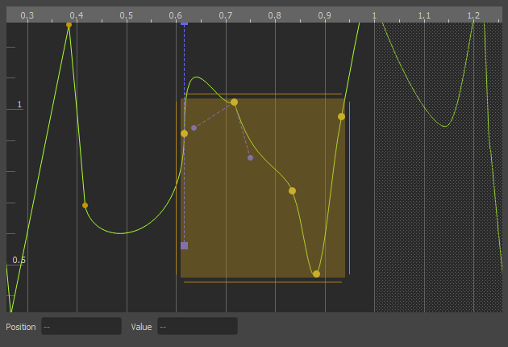

# Curves

*Curves* are used to animate properties. They are typically set up once and shared across many assets, such as [particle effects](../../effects/particle-effects/particle-effects-overview.md). Modifying a curve will affect all resources that use it. Therefore it is advisable to create common curves early during development.

The curve can be sampled along the X-axis. This is frequently used to sample a value over time, but other parameters may be used for the lookup as well. If a curve is supposed to be used in a looping fashion, the first and last control point have to be set up to match.

## Curve Editor

To add a control point, **double click** where you want to insert one.

### View

* *Right click and drag* to pan the view.
* Use the *mouse wheel* to zoom in and out.
  * Hold `Shift` or `Ctrl` to zoom the view only along the X axis or the Y axis.
* Press `Ctrl + F` or select *Frame* from the context menu to frame the view either on the selected control points, or the entire curve, when no point is selected.

### Selection

* *Left click* a point to select it.
* Press `ESC` to clear any selection.
* *Drag a rectangle* to select multiple points.
* Holding `Shift` always *adds* points to the selection.
* Holding `Alt` always *removes* points from the selection.
* Holding `Ctrl` *toggles* the selection of a control point.
* Distinguishing between *add* and *remove* is particularly useful when changing the selection by dragging a rectangle.

* Left click and drag selected points to move them around.
* Press `Shift` *after you started dragging*, to limit modifications to either left/right or up/down. The axis along which you moved the control points the most, before you pressed `Shift`, determines which axis gets limited.
* Drag the handles at the edges of the selection rect, to scale the selected points.

### Tangents

Every control point has two tangents to determine the slope of the curve coming from the left into the point and going out to the right of the point. Each tangent can use one of four modes. Some modes are fully automatic, some allow you to edit the tangents. To not clutter the UI, tangents that can be edited are only shown for selected control points. To change the mode, select a control point, open the context menu and choose from *Left/Right/Both Tangents > ...*.

* **Auto:** The default mode. Automatically configures the tangents to create a smooth curve.
* **Bezier:** Gives you full control over the tangents. Both slope and length of the tangents will affect the curve.
* **Fixed Length:** Although you can change both slope and length of the tangents, only the slope affects the curve. This is often easier to use than *Bezier*.
* **Linear:** This mode deactivates any curvature. Allows you to make hard corners.

#### Link / Break Tangents

By default adjusting one tangent at a control point, mirrors the change over to the other tangent. That's because the two tangents are *linked*. If you want the tangents to be independent of each other, you can *break* the link between the tangents. Use the context menu to do so.

### Looping Curves

The rightmost control point determines the overall length of the curve. As you can see, the editor repeats the display of the curve at that point, overlayed with a grey pattern. This enables you to see how the curve would look when used in a looping fashion.

To make a curve loop nicely, open the context menu and select *Curve > Loop: Adjust First/Last Point*. This will modify either the first or the last control point in the curve to match up with the respective other point. Make sure that the two control points use the same *tangent mode*. You may need to switch to *Bezier* or *Fixed Length* tangents to make the curvature match perfectly.

## See Also

* [Back to Index](../../index.md)
* [Color Gradients](color-gradients.md)
* [Property Animation (TODO)](../property-animation/property-animation-overview.md)
