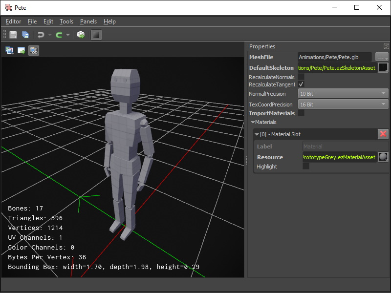

# Animated Mesh Asset

The animated mesh asset is very similar to the [mesh asset](../../graphics/meshes/mesh-asset.md). However, it adds the necessary data to a mesh such that it can be used for [skeletal animation](skeletal-animation-overview.md).

Animated meshes are placed in a scene with a dedicated [animated mesh component](animated-mesh-component.md). Which animations are played on it can be controlled with a [simple animation component](simple-animation-component.md) or an [animation controller component](animation-controller/animation-controller-component.md).

## Asset Properties

* `MeshFile`: The file that contains the mesh data. For animated meshes prefer to use **GLB** (binary GLTF) files. **FBX** files can be used as well, though due to FBX's complexity chances are higher that it won't work as expected. The referenced file must contain the mesh data with skinning information. It doesn't need to contain any animation clips.

* `DefaultSkeleton`: The [skeleton asset](skeleton-asset.md) that is used to skin the animated mesh by default.

* `RecalculateNormals`, `RecalculateTangents`: See the [mesh asset properties](../../graphics/meshes/mesh-asset.md#asset-properties).

* `NormalPrecision`, `TexCoordPrecision`: See the [mesh asset properties](../../graphics/meshes/mesh-asset.md#asset-properties).

* `ImportMaterials`: See the [mesh asset properties](../../graphics/meshes/mesh-asset.md#asset-properties).

* `Materials`: See the [mesh asset properties](../../graphics/meshes/mesh-asset.md#asset-properties).

## See Also

* [Back to Index](../../index.md)
* [Skeletal Animations](skeletal-animation-overview.md)
* [Skeleton Asset](skeleton-asset.md)
* [Animation Clip Asset](animation-clip-asset.md)
* [Simple Animation Component](simple-animation-component.md)
