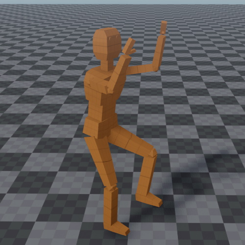

# Animated Mesh Component

An *animated mesh component* is used to instantiate an [animated mesh asset](animated-mesh-asset.md). Animated mesh components are mostly identical to regular [mesh components](../../graphics/meshes/mesh-component.md) except that they can only be used with [animated mesh assets](animated-mesh-asset.md). An animated mesh will be skinned with its current animation pose. Which pose is applied to an animated mesh can be controlled with a [simple animation component](simple-animation-component.md) or an [animation controller component](animation-controller/animation-controller-component.md).

## Component Properties

* `Mesh`: The [animate mesh asset](animated-mesh-asset.md) to render.
* `Color`: See [mesh component](../../graphics/meshes/mesh-component.md).
* `Materials`: See [mesh component](../../graphics/meshes/mesh-component.md).

## See Also

* [Back to Index](../../index.md)
* [Meshes](meshes-overview.md)
* [Skeletal Animations](skeletal-animation-overview.md)
* [Simple Animation Component](simple-animation-component.md)
