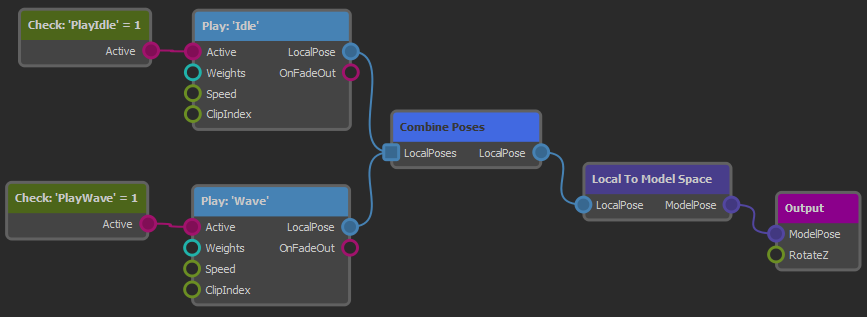

# Animation Controller

Animating characters is a complex task. Even simple creatures typically already need tens of different [animation clips](../animation-clip-asset.md) for locomotion and basic actions. However, having the animation clips is not enough, they also need to be played on the [animated mesh](../animated-mesh-asset.md) in such a way that animations blend over nicely and play perfectly in sequence. Additionally you may need to apply an animation only to a certain part of the body. Animations should fade in and out smoothly as they are activated and deactivated, and certain clips need to be synchronized to achieve the desired effect.

An *animation controller* is used to configure how each animation clip of a character should behave when it is actively played on the mesh. Animation controllers are the basis for complex animation playback. They also provide some very basic functionality for logic and math, such that one can build simple state machines. For more complex decisions which animations should play when, use [custom code](../../../custom-code/custom-code-overview.md).

## Creating and Using Animation Controllers

Animation controllers are configured through the [animation controller asset type](animation-controller-asset.md). To apply the output pose of an animation controller to an [animated mesh](../animated-mesh-component.md), add an [animation controller component](animation-controller-component.md) to the same [game object](../../../runtime/world/game-objects.md). The controller will send the output pose to the mesh every frame, but only while the scene is [simulated](../../../editor/run-scene.md).

To control what an animation controller will output, you typically also need a [blackboard](../../../Miscellaneous/blackboards.md). The blackboard is used to store state. Scripts or other [custom code](../../../custom-code/custom-code-overview.md) decide which animations should be played and write that state to the blackboard. The animation controller in turn reads state from the blackboard and then activates the desired animation clip playback. The controller can also write back state to the blackboard, for example to communicate back that an animation clip has finished playing.

## Animation Controller Concept

The following image shows a very basic animation controller:

The flow of information is from left to right.

On the far left side the two green nodes are used to [read state from the blackboard](anim-nodes-blackboard.md). Here we read the blackboard values *PlayIdle* and *PlayWave* to see which animation clips should get played. The pink output pins are *trigger pins*, meaning they can be *active* (*triggered*) or *inactive*. When the read value is `1` (in this case) the pins are set to *triggered* which then activates the connected nodes to the right.

The two light blue nodes are used to [sample animation clips](anim-nodes-playclip.md). There are different ways how animation clips can be played, but here we only use very basic (looped) playback. When the *PlayIdle* blackboard value is set, the *Idle* clip will be sampled. When the *PlayWave* blackboard value is set, the *Wave* clip will get sampled. Any combination is possible, so both clips can be played at the same time.

The sampling nodes have a *LocalPose* output pin. This pin represents the animation pose that was determined. The pin also carries information about *weighting* the pose. That means when the clip playback was just started, the pose may still be fading and shouldn't immediately have full influence. Similarly, if a pose shall only be applied to a certain body part these [bone weights](anim-nodes-bone-weights.md) are also included here and will be forwarded to any following node.

In the middle of the graph the [combine poses](anim-nodes-combine-poses.md) node is used to gather multiple poses and turn them into one. This node uses the aforementioned bone weights and overall pose weight to blend all the available poses together.

Note that the blue nodes output *local poses*. That means the pose data is in a certain format. Data in this format can be used for certain operations, however, the data cannot be output in this format. Therefore the next step is to convert the pose from *local space* to *model space*. Once the data is in *model space* there are other operations that can be done with it.

In this graph, though, the converted pose is simply forwarded to the [output node](anim-nodes-output.md). This is always the final step.

## Summary

The animation controller uses a graph based workflow to let you visually configure how animation clips are combined. Nodes have inputs to control their behavior, and they output data or state that can (or must) be forwarded to the next step in the pipeline, until an animation pose ultimately reaches the output.

The system is intelligent enough to optimize away operations that don't affect the output.

You typically control which animations are played when through a [blackboard](../../../Miscellaneous/blackboards.md). For quick prototyping you can also use the [input nodes](anim-nodes-input.md) to get certain input data directly into the graph.

Simple animation state machines can be built directly in the animation controller graph using the [logic and math nodes](anim-nodes-logic-math.md) as well as the [blackboard nodes](anim-nodes-blackboard.md). For more complex logic you should use [custom code](../../../custom-code/custom-code-overview.md).

## See Also

* [Back to Index](../../../index.md)
* [Skeletal Animations](../skeletal-animation-overview.md)
* [Animation Controller Asset](animation-controller-asset.md)
* [Animation Controller Component](animation-controller-component.md)
