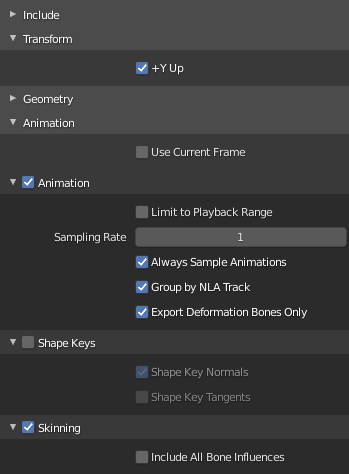

# Authoring and Exporting Animations with Blender

This page contains various pieces of information that are good to know when one uses Blender to build and export animated meshes. It is assumed that you know Blender well enough to create animated meshes.

## Exporting Animated Meshes

1. To get animated meshes out of Blender and into ezEngine, export the animated mesh to a binary GLTF file (`.glb`).
1. You can enable `+Y up` or not. In both cases you need to adjust the transformation on the [skeleton asset (TODO)](skeleton-asset.md).
1. Make sure that the GLTF export contains *Animations* and *Skinning* information.
1. Don't disable animation sampling on export.
1. Be aware that GLTF uses 1000 frames per second for all exported animation clips. Blender, by default, uses 24 frames per second. If you want to only use a sub-range of an animation in EZ, you will need to re-calculate the frame indices accordingly. You can set Blender to use 25 or 50 frames per second to make this calculation easier.
1. Enable `Export Deformation Bones Only` to strip IK pole targets and other unnecessary bones from the file.

## Importing Meshes into EZ

When importing a mesh, EZ remaps the model space to its own convention. You may need to change the mapping, to get the desired result. For static meshes, this is configure on the [mesh asset](../../graphics/meshes/mesh-asset.md). For animated models, the mapping is chosen on the root node of the corresponding [skeleton asset (TODO)](skeleton-asset.md).

EZ uses the following convention:

1. `+X` is the **forward axis**
1. `+Y` is the **right axis**
1. `+Z` is the **up axis**

By default all code uses `+X` as its main direction. For example AI nodes move characters *forwards* along the `+X` axis, spot lights and cameras "look" into the `+X` direction and so on.

In Blender it is common to have a character look along the `-Y` axis so that it faces the user when pressing `Numpad 1`. This also means that the right side of the character will be along the `-X` axis.

If you export such a mesh to a GLB and enable **Y UP** convention, you need to configure the mapping this way:

* Set `Right Dir` to **Negative X**
* Set `Up Dir` to **Positive Y**
* Set `FlipForwardDir` to **off**

## Authoring Meshes

1. Make sure all triangles face into the same direction. Use Blender's `Face Orientation` viewport option to see whether there are flipped triangles. If there are flipped triangles, they will show up incorrectly in EZ.

## Authoring Animations

1. EZ only supports skeletal animations via skinned meshes. That means every vertex in the mesh needs to have a bone assigned via vertex weights. Blender can move entire objects through bone animations, but if they are only parented to a bone, and don't use vertex skinning (vertex weights), EZ will not show those objects as animated. Use the *Vertex Group Weights* visualization in Blender to inspect which vertices are set up properly and which aren't.

1. Be aware that Blender exports ALL keyframes of an animation. The preview window of an animation has no effect on the exported animation data.

1. Blender always sets the first keyframe of all animations to index `1` and that is also how the data is exported. EZ expects the first keyframe to be at index `0`, though. So set the animation range in Blender to start at index `0` and put the first keyframe there.

### Animation Cycles

1. To create an animation that can be repeated, such as walk cycles, the first and the last keyframe must be identical.
1. Furthermore, Blender will typically use cubic interpolation between the keyframes. For the first and last keyframe this will result in an interpolation that slows down and speeds up and is therefore not smooth. The simplest solution is to set these (or all) keyframes to use *linear interpolation* instead.
1. Another option is to insert duplicated dummy keyframes before the first and after the last keyframe, to force the desired interpolation, but then you need to configure the animation clip in EZ to only use the proper sub-range of keyframes, which can be tricky to figure out.

## See Also

* [Back to Index](../../index.md)
* [Skeletal Animations](skeletal-animation-overview.md)