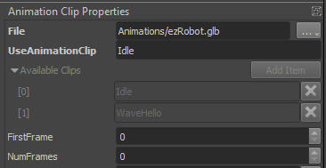
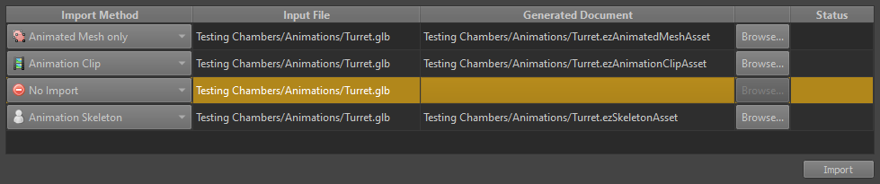

# Skeletal Animations

<video src="../media/skeletal-anim.webm" width="500" height="500" autoplay loop></video>

Skeletal animation is being worked on, but so far only a very rudimentary feature set is available. Nevertheless, since this is an often asked about topic, this page describes how to use the existing functionality, so that you see what functionality is there, and also what is currently missing.

Since this is all heavily work-in-progress, even the functionality that already exists is subject to change, and is not guaranteed to work at all.

## Sample Scene

For a sample scene to look at, open the **Animation** scene from the [Testing Chambers](../../samples/testing-chambers.md) project.

## The Animation System Pieces

The following elements are involved to make an animated mesh:

### Animated Mesh Asset

The *animated mesh* [asset](../../assets/assets-overview.md) represents the mesh of the animated object. This is a special version of the [mesh asset](../../graphics/meshes/mesh-asset.md). It works mostly the same way, except that it adds the necessary skinning information. Consequently, only these kinds of meshes can be used for skeletal animation. An animated mesh asset (currently) requires you to specify a **default skeleton** asset, otherwise it won't even transform the data.

### Skeleton Asset

The *skeleton* asset stores the bone hierarchy of the animated object. This is also where you configure the overall scaling and which direction should be the forward, right and up vector of the imported model. In the future the skeleton asset is also supposed to be used to set up physics collision shapes, but this is currently not yet implemented.

### Animation Clip Asset

The *animation clip* asset represents **a single animation**, such as a walk or a jump animation. You may have multiple animations stored in a single `.fbx` or `.glb` file, but you need to create one animation clip asset for each animation that you want to import into ez. Just reference the same source file each time. The animation clip asset has a property `UseAnimationClip` through which you can choose which animation to extract from the source file. Currently you have to **type** the name of the animation. The *Available Clips* list just below it shows you which animations have been found in the file.

Additionally, in case all animations are in one large clip, you can use the `FirstFrame` and `NumFrames` properties to extract only a subset of the animation. This allows you to import the same source file many times, each time extracting only a specific range as a single clip.

The *root motion* properties are meant for enabling an animation clip to move an animated character (ie. the actual character controller that sits on top of the animated mesh), however this is currently in the more experimental part of the code, so just ignore this.

The *event track* property allows you to add markers to the clip, that indicate what happens at what time in the clip. This can be used to indicate when a foot touches the ground, or at what point in the animation a weapon fires. Using this information, the game logic could react by, for example, spawning an effect. At the moment the event track is exposed as raw data, this is supposed to have a nice UI later on. For the time being you have to set the *tick* and the name of the event manually. There are **4800 ticks per second**. That means if you want to add an event 2.5 seconds into the animation, you have to place it at tick 12000.

Animation events are sent as [event messages](../../runtime/world/world-messaging.md#event-messages) and therefore can only be captured by *event handler components* such as [visual scripts](../../custom-code/visual-script/visual-script-overview.md) or [TypeScript components](../../custom-code/typescript/typescript-overview.md).

### Animated Mesh Component and Simple Animation Component

Once you have an animated mesh asset, a skeleton asset and an animation clip asset all set up, you can create an animated object in a scene by attaching an *Animated Mesh Component* and a *Simple Animation Component* to a game object like so:

Here we have also attached a visual script to react to events in the animation clip, but that is entirely optional. When you press play, the editor will play back the animation on the mesh.

## How to Import an Animated Mesh

To import an animated object, you need to set up multiple assets (the mesh, the skeleton, the animation clips). The easiest way is to press **CTRL+I** to open the [asset import dialog](../../assets/import-assets.md). Select your `.fbx` or `.glb` file and choose to import it as multiple asset types like so:

This will create all three necessary asset types. You can repeat this process, if you want to import multiple animation clips (select *No Import* for the other asset types then). You'll need to change the filename for each additional animation clip asset.

## Animation Utility Components

The following components are currently available:

### Joint Attachment Component

If you put a child object under an object with an animated mesh component, and attach a *Joint Attachment Component*, the animation system will take control over that object's position. With the **JointName** property you specify a bone that you are interested in (see the skeleton asset, if you need to know what bones are available). Every game tick, the animation system will then move that game object to the position of the animated bone. This allows you to have game objects move in sync with the animation. This can be used to put an object into the hand of a creature, or to have an effect follow the animation.

In the sample scene this is used to place an object at the (animated) front of the turret's barrel, such that the projectile will be spawned at the proper position.

### Joint Override Component

This component is the opposite to the *Joint Attachment Component*. It works similar in that it has to be attached to a child object of an animated mesh and you have to type in the name of a bone. However, it will then *override* the specified **bone's local transform** with its **own local transform**. The idea here is, that game code can use this game object as a controller to steer the animated object. So for example your turret might be one complex animated object, with many bones but somewhere in the bone hierarchy there is one bone that controls the turrets aim (up/down or left/right or both). You want cool animations to "unfold" the turret when it is built and all sorts of other animations that are only possible with proper skeletal animation, but once the game runs you also want to procedurally control where the turret is aiming. Using this component you can take control of certain bones and drive their animation yourself.

In the sample scene there are two objects for each turret that override two bones: one for left/right rotation and one for pointing up/down. You can manually modify these values from the property grid, while the editor is in play mode, to control the turrets aim. Note how the recoil animation continues to play properly relative to the turret's main direction.

## How to use this System

The honest / short answer is: don't

The features described above are MOSTLY what's there at the moment, and as you can imagine it is quite limited what you can achieve with that. You can basically play a single animation on a mesh. You could (probably) switch the active animation clip and use the speed controller to pause/resume animations, but if you build a character with that, it will be very choppy. The best thing you can do with it at the moment is environmental art, where you have animated objects in a scene that just loop something or play an animation when the player comes close. Maybe it's sufficient to build a tower-defense game :D

## Future Work

There is ongoing work to build a way more sophisticated system to blend animations, transition from one animation to the next and so on. However, this is in a very early stage of development.

## See Also

* [Back to Index](../../index.md)
