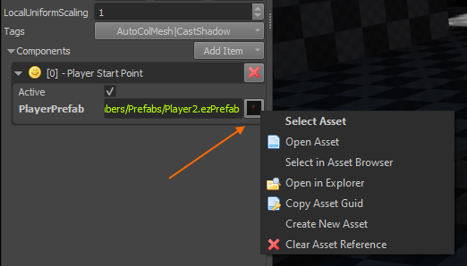

# Asset Browser

The *asset browser* is used for selecting and opening asset [documents](../editor/editor-documents.md). Assets can be filtered by type and path or searched for by name.

If the asset browser panel is not visible, select *Panels > Asset Browser*. You will notice that the asset browser will show up in two modes. The *panel* is constantly visible and can be interacted with at all times, to search for assets and open them via double click, or instantiate them with drag and drop. Additionally, when an object has an *asset reference property*, choosing *Select Asset* from the button menu right next to it will open another asset browser in *file picker mode*.

Several other options are available, for example, *Open Asset* allows you to open the referenced asset document, which can be useful to follow a chain of asset references.

## Search

The *Search* field in the top-left corner allows you to search for assets by name, path and GUID. The search by path or name is case insensitive. For paths, both slashes and backslashes are allowed. You can also input the GUID of an asset (for example *{ 1c47ee4c-0379-4280-85f5-b8cda61941d2 }*).

## Filter by Asset Type

Below the search field, all available asset types are listed with checkboxes. Click the checkboxes to only display assets of those types. Click *\<All\>* or uncheck all asset types to display assets of all types.

## Filter by Folder

On the bottom left the asset browser displays all [data directories](../projects/data-directories.md). When you select a folder in this tree view, the asset browser will only display assets located below that folder.

### Show Assets in Sub-Folders

Right click on a folder and toggle **Show items in sub-folders**. When enabled (the default) the asset browser shows *all* assets that are anywhere below a selected folder. When disabled, only the assets that are directly inside the a selected folder are shown. Assets that are in a sub-folder are not displayed.

### Hidden Folders

By default when an asset is located in a folder with a **_data** suffix (e.g. 'MyAssets_data'), it is not displayed in the asset browser, unless you select exactly that folder in the asset browser. This way you can easily hide assets that are rarely needed. Hidden folders are indicated with a grey font.

A common use case is to put [materials](../materials/materials-overview.md) and textures that are very specific for a [mesh](../graphics/meshes/meshes-overview.md) or [prefab](../prefabs/prefabs-overview.md) into a *xyz_data* subfolder to group the data together, but prevent it from cluttering the asset browser.

You can toggle this feature by right clicking any folder and selecting **Show items in hidden folders**.

## Create Asset Documents

You can create new asset [documents](../editor/editor-documents.md) by right clicking a folder on the bottom left, or an asset on the right and selecting *New > Asset Type*. The advantage over creating a document via *Editor > Create Document...* is that the create file dialog opens directly in the location of the selected asset or folder, which makes it easier to create a new asset next to an existing asset.

## Display Assets in Recently Used Order

The editor remembers which assets you used recently. The asset browser can list recently used assets at the top. This option can be toggled from the context menu on the right hand side of the asset browser. Note that the state of this option is remembered separately for the asset browser *panel* and for the asset browser when used as a *file picker*. In panel mode, it is typically disabled and all assets are sorted alphabetically, in file picker mode, it typically sorts by recently used time.

## Copy Asset Guid

In rare cases you may need the internal *GUID* (Globally Unique Identifier) of an asset. You can easily copy it to the clipboard by right clicking an asset and selecting *Copy Asset Guid*.

## Transform Assets

The asset browser allows you to quickly transform assets in multiple ways:

* **Transform All:** In the toolbar of the asset browser there is a button of a white box with a red arrow. When you press this button *all* assets that are not up-to-date get *transformed* (ie. their runtime data is created from the source input data).

* **Transform Selected:** Select one or multiple assets in the asset browser, right click and choose *Transform* to update only the selected assets.

* **Transform Single:** You can also quickly transform just a single asset by clicking the icon overlay at the bottom right of an asset's thumbnail (usually a checkmark or a gear).

## Resave all Asset Documents

The rightmost button in the asset browser's toolbar triggers an action to open each and every document, save it and close it again. This can be used to migrate all documents to the very latest version. Since document versioning is very robust, there is little practical use for this operation, though.

## Check Filesystem

The leftmost button in the asset browser's toolbar makes the editor check the filesystem for changes that were missed by the automatic filesystem watcher. This may be useful when you added or removed assets on disk and the changes are not reflected in the editor.

## Background Processing and Transform State

At the bottom right of the asset browser there is a widget with a colored progressbar and a play button.

The play/pause button is for switching **background processing** on and off. If enabled, outdated assets are automatically transformed in the background. The progressbar displays how many assets need updating and whether there were any errors. For details about processed assets and potential errors, check out the [asset curator](asset-curator.md). If you do not want assets to be transformed automatically, disable background processing with the pause button.

## Drag and Drop

You can drag assets from the asset browser into other documents, such as [scenes](../scenes/scene-editing.md). For mesh and prefab assets this will instantiate the asset (ie. create a new node that references the asset). For [materials](../materials/materials-overview.md) this may assign the material to the object that you drag it onto. Not all asset types support drag and drop. Also dragging an asset into the 3D viewport can have a different effect than dragging it into the scene tree.

## Video

## See Also

* [Back to Index](../index.md)
* [Asset Curator](asset-curator.md)
* [Editor Documents](../editor/editor-documents.md)
* [Asset Import](import-assets.md)
