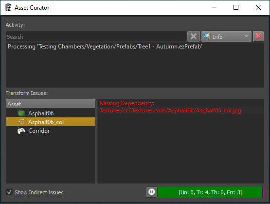

# Asset Curator

The *asset curator panel* is a tool to help find and fix problems with [assets](assets-overview.md). If the panel is not visible, use *Panels > Asset Curator* to open it.

## Activity

At its top the asset curator panel displays an activity log. If *background transform* is active, this shows which assets have been transformed recently. Whether background transform is enabled can be seen from the progress bar at the bottom:

## Transform Issues

If an asset fails to transform for some reason, it will be listed in the view to the bottom left. The most common issue is a missing file reference. For example when a texture source file has been moved or renamed, the texture asset can't find it anymore and thus fails to transform.

When you select an asset from that list, the log at the bottom right will display any error message from the failed transform. Double click the asset to directly open the document.

If **Show Indirect Issues** is disabled (the default), only assets that have problems finding their source files are displayed. Otherwise all assets which failed to transform are displayed, however, most of them will be follow-up issues due to other assets being incomplete.

Once you fix an asset and make sure it is transformed, the asset curator will no longer show it in the issues list.

## Video

## See Also

* [Back to Index](../index.md)
* [Asset Browser](asset-browser.md)
* [Assets](assets-overview.md)
