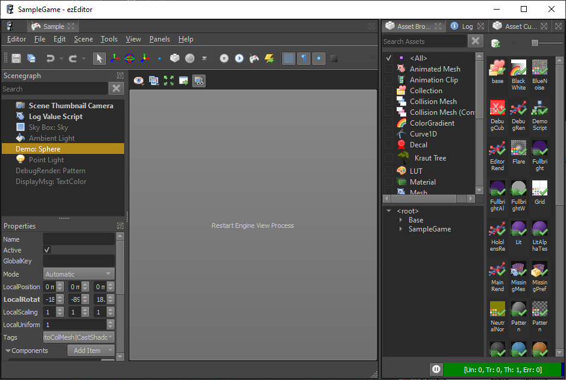
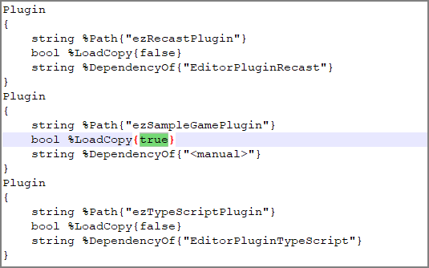

# Hot Reloading C++ Game Plugins in the Editor

When writing game code in C++, the most annoying aspect are the iteration times. Due to how C++ works, it is nearly impossible to swap out code and replace it with a newer version. Some engines try to do this, but there are always limitations, and the effort to get this working and keep it from breaking is quite big.

ezEngine is no different here, reloading code at runtime is not possible. However, the editor is split into two processes: The actual *editor process* which displays the UI, and manages the scene state, and the *engine process* which does the scene rendering and executes the actual game code. This separation makes the editor more resilient to crashes. If the engine process crashes, the editor will typically just display this:

When you click the button, the editor launches a new engine process, synchronizes the latest scene state over and continues as if nothing happened.

That of course means, that when the new engine process launches, it also loads the latest state of all plugins. So if any of the plugins was modified, we would now see these modifications. So by simply nuking and restarting the entire engine process, we can get some form of C++ code hot reloading.

Unfortunately, you can't compile a plugin while a process is using it, because the process prevents other applications from writing the DLL. We can solve this problem, by making a copy of our game plugin DLL, and loading that instead. That means that the original DLL is not actually used, and our IDE can modify it further.

This trick works quite well if we only do it for plugins that are loaded fully dynamic, meaning that no other plugin tries to link against it. If that were the case, both the original plugin, as well as the copied plugin would get loaded, which is not good. Therefore only select game plugins may use this copy mechanic, which is why you need to set this up manually.

## How to Enable Plugin Hot Reloading

For this feature there is no UI, you need to edit a config file directly.

### Edit Plugin Config File

1. If you have any editor open, close it.
1. Go to the directory where your project is located, for example `Data/Samples/SampleGame`.
1. Open the file `Plugins.ddl` in a text editor.
1. You should see a list of all the known engine plugins. Search for the plugin for which you want to enable reloading, for example `ezSampleGamePlugin`.
1. Change its `LoadCopy` value to `true`.
    
1. Save and close the text file.
1. Open your project in the editor.

If all goes well, everything should work as before. The only difference is now, that you can modify the code of your plugin and compile it, while the editor is open. Of course you can't do that while being attached with a debugger, so detach your debugger, if necessary.

### Terminate and Restart the Engine

Select *Tools > Reload Engine* or just press `Ctrl+Shift+F4`.

This instructs the editor to kill its engine process and restart it right away. This takes a few seconds, and you will see the 3D viewports flicker and notice how the new engine process loads all the data. Once that is done you can again [simulate the scene](../../editor/run-scene.md) and will now get the latest behavior from your game plugin.

## Restrictions

The `LoadCopy` option should only be used for select game plugins. Enabling this feature can have unintended side-effects.

* If any code links against a plugin, that plugin cannot be loaded as a copy. Therefore, if you want to put shared code into a separate library that other of your plugins link against, you can't load that shared library as a copy.
* You can't compile code while debugging a process. To compile your code, you first have to detach your debugger.
* Consequently, if you want to continue debugging after you restarted the engine process, you need to manually re-attach your debugger to *EditorEngineProcess.exe*.

## See Also

* [Back to Index](../../index.md)
* [Debugging C++ Code](../../debugging/debug-cpp.md)
* [Engine Plugins](engine-plugins.md)
