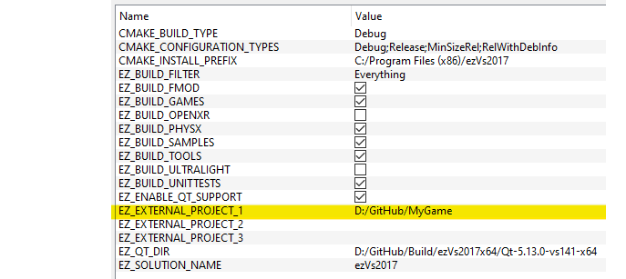

# Custom Code with C++

To extend the engine with C++ code, you should put your code into an [engine plugin](engine-plugins.md). This enables both the editor as well as [ezPlayer](../../tools/player.md) to load and execute your code.

## Build Setup

The first thing you need to set up is your build system, meaning you need to have a project for your plugin. The easiest way to do so, is to add your own project into the ezEngine source tree and just use ez's CMake build setup and generated solution.

A cleaner approach is to do basically the same, but to put your code outside the ez source tree, and add a reference to that folder:

This will integrate you source into the ezEngine solution. Make sure to use the same CMakeLists.txt files as the engine plugins in ez do. With this option, you can have your code in a separate repository.

Another way is to use your own CMake based build setup, and integrate [ezEngine as a Submodule](../../build/submodule.md).

All three solutions give you tight integration of your code and the ezEngine code, which makes debugging more convenient. You can, of course, also build ezEngine once and just link against its libraries.

## Custom Game Code

For an example how to set up a game plugin, see the [Sample Game Plugin](../../samples/sample-game-plugin.md). It is best to start with writing a [custom component](custom-cpp-component.md).

If you need higher level game logic, have a look at [game states (TODO)](../../runtime/application/game-state.md). Also have a look at [input (TODO)](../../input/input-overview.md).

Once you add more complex systems, you may need the [startup system](../../runtime/configuration/startup.md) to properly initialize them and shut them down.

## Debugging & Profiling

The chapter [Debugging C++ Code](../../debugging/debug-cpp.md) gives some useful tips. Things you should also be aware of are the [console](../../debugging/console.md) and [CVars](../../debugging/cvars.md), as well as [stats](../../debugging/stats.md) and [debug rendering](../../debugging/debug-rendering.md).

Finally, have a look at [profiling (TODO)](../../performance/profiling.md), to know where your code spends most of its time.

## Standalone App

If you want to write your own stand-alone application, have a look at the [application (TODO)](../../runtime/application/application.md) chapter. However, we encourage you to have your entire game code in a plugin, otherwise you can't use any of it in the editor. You would mostly need your own application for the finishing touches of how you present the main menu, etc, and a good starting point is to just copy the [ezPlayer](../../tools/player.md) and make adjustments.

## See Also

* [Back to Index](../../index.md)
* [Custom Code](../custom-code-overview.md)
* [Sample Game Plugin](../../samples/sample-game-plugin.md)
* [Engine Plugins](engine-plugins.md)
* [The World / Scenegraph System](../../runtime/world/world-overview.md)
