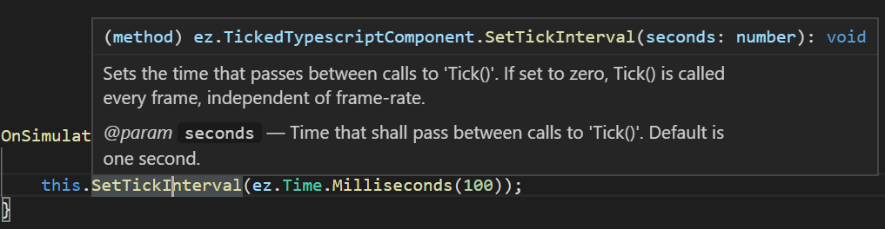

# TypeScript API

This page gives an overview over the functionality that ez exposes through TypeScript. For an introduction to the TypeScript language please refer to the web (for example [TypeScript in 5 minutes](https://www.typescriptlang.org/docs/handbook/typescript-in-5-minutes.html)).

Note that you don't need to install anything to use TypeScript in ez, the required TypeScript transpiler is already included.

## API Documentation

All TypeScript APIs are documented with code comments. In Visual Studio Code you can see the documentation for each function by hovering the mouse cursor over it:



You can also **jump to a function or class declaration** using `F12`. This is useful to see what functions are available on a given class.

## Importing Files (`require`)

TypeScript and JavaScript have multiple mechanisms how to make code from other files available. In ez only the `require` mechanism will work:

```typescript
import ez = require("TypeScript/ez")
```

This imports all *exported* declarations from the file *TypeScript/ez.ts* into an object called *ez* in this file. Thus typing `ez.` grants access to all the exported classes, namespaces and functions from that file.

The path given to `require` must be relative to a [data directory](../../projects/data-directories.md). For example, the file above is located in the *Plugins* data directory.

> **Note:**
>
> `require` always returns an object and therefore you must assign its result to a variable. Consequently, there is no way to make the imported names globally accessible, you can only access them through that variable.

To import multiple files, you need to store each result in a different variable:

```typescript
import ez = require("TypeScript/ez")
import _ge = require("Scripting/GameEnums")
```

### Re-exporting Imported Declarations

You can re-export declarations from a `.ts` file that you imported from somewhere else. For plenty of examples, look at the file *ez.ts*:

```typescript
import __Log = require("TypeScript/ez/Log")
export import Log = __Log.Log;
```

Here, everything from the file *Log.ts* is imported into the variable `__Log`. We then selectively re-export the namespace `Log` from the variable `__Log` again, under the name `Log`. We could rename the exported symbol, if we wanted.

Unfortunately, there does not seem to be a way to re-export *all* declarations automatically, you need to name each one individually.

## Scenegraph

### ez.Component

`ez.Component` is the base class for all component types, including the C++ components. Your custom components must extend either `ez.TypescriptComponent` or `ez.TickedTypescriptComponent`.

The functionality exposed through `ez.Component` is mostly identical to all other [components](../../runtime/world/components.md).

If you hold a reference to a component for more than a frame, it is vital to use `ez.Component.IsValid()` to check whether the component is still alive, before accessing it. If `IsValid()` returns true, the component can be accessed safely for the rest of the frame.

### ez.GameObject

`ez.GameObject` exposes the [game object](../../runtime/world/game-objects.md) functionality to TypeScript mostly 1:1. Through this you modify object positions, delete or move child nodes, access attached components and send messages.

You can't extend game objects.

If you hold a reference to a game object for more than a frame, it is vital to use `ez.GameObject.IsValid()` to check whether it is still alive, before accessing it. If `IsValid()` returns true, the game object can be accessed safely for the rest of the frame.

### ez.World

`ez.World` exposes the [world](../../runtime/world/worlds.md) functionality. However, the functionality provided is only a limited subset. Some functionality is simply not needed in the TypeScript binding, and some is exposed differently.

Since all TypeScript code is executed in the context of one specific world, you can't access a different world from TypeScript code. Therefore, there is no need to *get* the world that you operate in (as is common in C++). Therefore `ez.World` is only a namespace, not a class, and all functionality is always accessible.

Additionally, functionality like `ez.Clock` and `ez.Random`, which are in C++ bound directly to a world, are similarly just global namespaces in TypeScript and not exposed through `ez.World`.

### ez.Message

`ez.Message` and `ez.EventMessage` are base classes for all messages. The page [Messaging in TypeScript Code](ts-messaging.md) goes into more detail.

## Math

TypeScript already provides mathematical functions through the `Math` namespace. Additionally, the ez API provides these classes:

* `ez.Vec2` and `ez.Vec3`: 2 and 3 component vectors for 2D and 3D linear algebra.
* `ez.Mat3` and `ez.Mat4`: A 3x3 and 4x4 matrix.
* `ez.Quat`: A quaternion class to handle rotations.
* `ez.Transform`: A transform stores a position (`ez.Vec3`), a rotation (`ez.Quat`) and a scale factor (`ez.Vec3`). It is mainly used to represent object transformations, and is more convenient than using 4x4 matrices.
* `ez.Angle`: Provides utility functions to work with angles. Mostly to convert between radians and degree.
* `ez.Color`: A utility class to work with colors. All colors are treated as HDR colors in linear space, though conversions to and from Gamma space are provided. See [color spaces (TODO)](../../appendix/color-spaces.md) for details.

## Debugging

### ez.Log

The `ez.Log` namespace contains functions for writing messages to the [log](../../debugging/logging.md). This is a useful tool for debugging.

### ez.Debug

The `ez.Debug` namespace contains various functionality. There are functions for debug rendering, ie. to insert shapes into the rendered output, which can be helpful in visualizing many aspects. `ez.Debug` also provides access to [CVars](../../debugging/cvars.md) and [console functions](../../debugging/console.md#console-functions).

## Utilities

### ez.Clock

The `ez.Clock` namespace has functions to access the [world's](../../runtime/world/worlds.md) clock. The clock represents the game time, meaning it advances at its own pace, which can be adjusted dynamically. When you need to know how much time has passed since the last frame (not the last `Tick()`), use `ez.Clock.GetTimeDiff()`. Use `ez.Clock.GetAccumulatedTime()` it you need to measure longer durations.

### ez.Time

In TypeScript code time should be stored as `number` types and measured in seconds. This is how all functions expect time values. `ez.Time` contains utility functions to convert time values to other units and to query the current system time. 

### ez.Random

The `ez.Random` namespace contains functions to get random numbers.

## Physics

In `ez.Physics` you find functions to query the physics engine. For example to do raycasts or overlap tests.

## See Also

* [Back to Index](../../index.md)
* [TypeScript Component](ts-component.md)
* [Messaging in TypeScript Code](ts-messaging.md)
