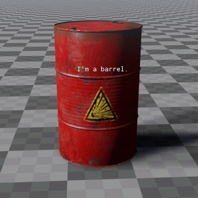

# Debug Text Component

The *debug text component* can be used to display a short piece of text at the location of the object.

> **Important:** If this component is attached to an object that has no other rendered component, its text will not show up! This component will only render its text, if the parent object is already being rendered because of other things, such as an attached [mesh (TODO)](../../graphics/meshes-overview.md).

## Component Properties

* `Text`: The text to display. It may contain placeholders for up to four float values, e.g. `{0}`, `{1}`, etc. The values of the properties `Value0` to `Value3` will be embedded into the text.
* `Value0, Value1, Value2, Value3`: Four float properties that can be set to arbitrary values. If `Text` contains appropriate placeholders, these values will be displayed.
* `Color`: The color of the text.

## See Also

* [Back to Index](../../index.md)
* [Debug Rendering](../debug-rendering.md)

