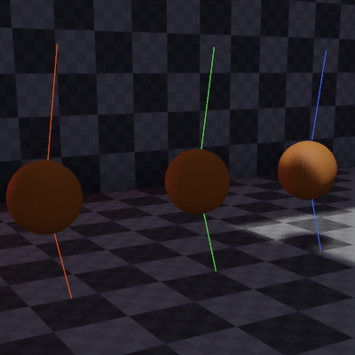

# DrawLineToObject Component

The *line-to component* is a utility component that simply draws a colored line from its own location towards the position of a [referenced object (TODO)](../../scenes/object-references.md). This can be useful for debugging various aspects.

## Component Properties

* `Target`: The [referenced object (TODO)](../../scenes/object-references.md) to which to draw the line.
* `Color`: The color of the line.

## See Also

* [Back to Index](../../index.md)
* [Debug Rendering](../debug-rendering.md)
