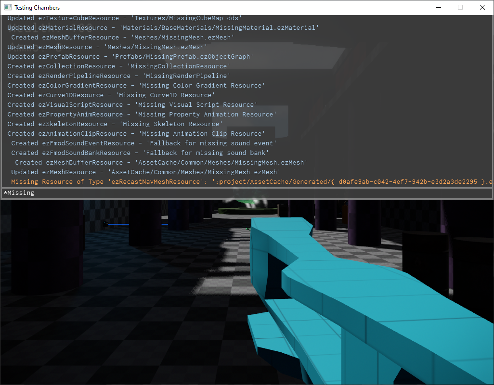

# Console

The in-game console is a utility for inspecting the [log](logging.md), modifying [CVars](cvars.md) and calling [console functions](#console-functions).



## Key bindings

The default key binding for the console is:

* **F1** - Opens/closes the console.
* **Up / Down** - Select a previously entered command from the history.
* **F2** and **F3** - Repeat last and second-to-last commands. This works even when the console is currently closed.
* **ESC** - Clears the input line.
* **Page Up / Page Down** - Scrolls the log output up / down.
* **TAB** - Auto-completes the current input. Also displays all available input options in the output. Ie. lists the names of CVars and console functions and prints their descriptions.
* **Enter** - Executes the typed command. If the typed text is only the name of a CVar without an assignment, this will simply print the current value and the description of the CVar.

## Modify CVars

You can modify CVars by typing:

```cmd
CVarName = value
```

See the [CVars](cvars.md) chapter for details.

## Binding Keys

To bind commands to certain keys you can call:

```cmd
bind f g_showFPS=
```

This would bind the command 'g_showFPS=' (which toggles the display of the FPS counter) to the f-key. You can only bind commands to printable characters (a-z, 0-9) and the casing matters. So you can also bind another command to SHIFT+f by using `bind F ...`.

To unbind a key call:

```cmd
unbind f
```

## Search

You can filter the output of the console (the log messages) to only strings that contain some string by typing a **\*** at the beginning:

```cmd
*some text
```

Now the output window will only show strings that contain 'some text'.

## Console Functions

Console functions are an easy way to expose C++ utility functions through the console. The class `ezConsoleFunction` is used to wrap any function (static or method function) in a delegate and enable the console to call it. Of course, since the user can only input certain types of variables in the console, the argument types that you can use are very limited: strings, numbers (int / float) and boolean.

This code snippet shows how to declare a console function in a class, for example inside a custom [game state](../runtime/application/game-state.md).

<!-- BEGIN-DOCS-CODE-SNIPPET: confunc-decl -->
```cpp
void ConFunc_Print(ezString sText);
ezConsoleFunction<void(ezString)> m_ConFunc_Print;
```
<!-- END-DOCS-CODE-SNIPPET -->

In the implementation the binding has to be completed. You need to provide a name under which to expose the function, a description (this should include the parameter list) and the actual function to forward the call to. For member functions this has to be an `ezDelegate` to also bind to the class instance (`this`).

<!-- BEGIN-DOCS-CODE-SNIPPET: confunc-impl -->
```cpp
SampleGameState::SampleGameState()
  : m_ConFunc_Print("Print", "(string arg1): Prints 'arg1' to the log", ezMakeDelegate(&SampleGameState::ConFunc_Print, this))
{
}

void SampleGameState::ConFunc_Print(ezString sText)
{
  ezLog::Info("Text: '{}'", sText);
}
```
<!-- END-DOCS-CODE-SNIPPET -->

When you now open the console (F1) in-game and press TAB, the 'Print' function will be among the listed functions. You can then execute it:

```cmd
Print("Hello Console")
```

If you need to call a certain function repeatedly, you can [bind the call to a key](#binding-keys) or use F2 and F3 to repeat it, as long as it is the last or second-to-last command in your history.

### TypeScript

You can also register custom console functions through the [TypeScript API](../custom-code/typescript/ts-api.md#ezdebug).

## See Also

* [Back to Index](../index.md)
* [CVars](cvars.md)
* [Logging](logging.md)
