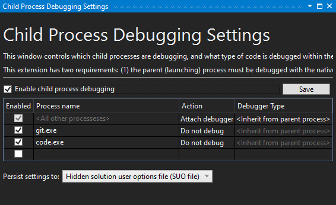

# Debugging C++ Code

## Visual Studio Debug Visualizers

To ease debugging the C++ code, we provide a `natvis` file, located at *Utilities/Visual Studio Visualizer/ezEngine.natvis*. The file adds improved inspection for ez specific code, such as the [container](../appendix/container-usage.md) and [string](../appendix/string-usage.md) classes.

This file is already referenced by our CMake scripts in the `Foundation` library and therefore works out of the box.

## Debugging the Editor

Please be aware that the editor uses at least one, but potentially multiple child processes for its operation. Everything that is actually 3D rendered, is done by the `EditorEngineProcess`, which is spawned when the editor opens a project. This makes the editor more resilient. However, it means that if you launch the editor in a debugger, by default breakpoints inside the engine runtime code cannot be hit, as you are not attached to the right process.

You can attach manually to this process. However, it is much easier to use an extension for Visual Studio: **Microsoft Child Process Debugging Power Tool**

This tool enables Visual Studio to automatically attach to all child processes spawned by the parent process, which makes debugging the ez editor much easier.

After installing the extension go to *Debug > Other Debug Targets > Child Process Debugging Settings...*. There you need to enable child process debugging. Additionally, you may want to exclude debugging Git (`git.exe`) and Visual Studio Code (`code.exe`), as those may be spawned by the ez editor (indirectly) and have some annoying behavior when attached to with a debugger:

## Hot Reloading C++ Game Code

You can't reload any C++ code at runtime. You can, however, reload the entire engine process in the editor. See [this chapter](../custom-code/cpp/cpp-code-reload.md) for details.

## See Also

* [Back to Index](../index.md)
* [Debug Rendering](debug-rendering.md)
* [PhysX Visual Debugger](../physics/physx-visual-debugger.md)
* [Shader Debugging](../graphics/shaders/shader-debugging.md)
* [Hot Reloading C++ Game Plugins in the Editor](../custom-code/cpp/cpp-code-reload.md)
