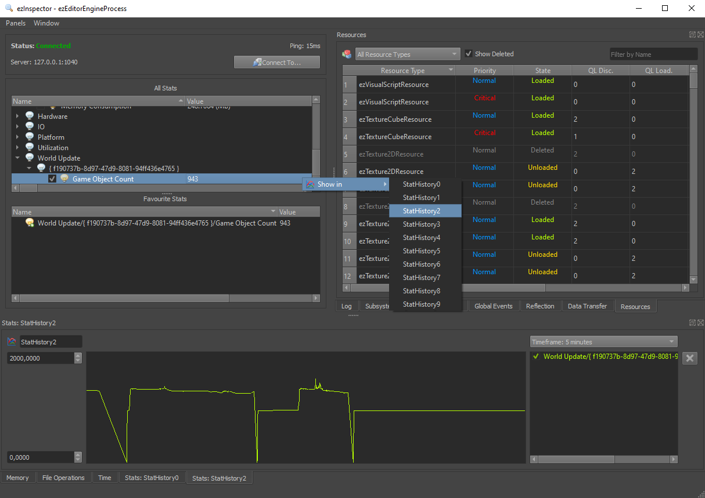

# Stats

Stats are a feature for development and debugging. They are arbitrary key/value pairs that your application can set and update frequently, typically once per frame.

Stats can be seen and plotted as a graph in [ezInspector](../tools/inspector.md).

## C++ Interface

The stats system is available through `ezStats`. This class allows you to add, modify and remove stats. The ezInspector plugin will listen to all changes and send the updated values over the network to ezInspector for visualization.

You can make ezInspector put your stats into a tree structure by using slashes in the stat name.

## Use Cases

Common use cases for stats are to output:

* Number of things of interest (render polygons, active NPCs, ...)
* Time spent doing X (script execution, AI updates, ...)
* Network status (bandwidth usage, ...)

Stats are very useful to give an insight into data that is otherwise hidden. They are particularly useful when the way a value behaves is of interest. That means when a value fluctuates and thus may be responsible for inconsistent performance or sudden spikes. When such a value is plotted as a graph in ezInspector and put side-by-side with the frame time, it can become easier to find correlations.

## ezInspector

Stats appear in a tree structure. You can mark certain stats as 'favorites' using the checkmarks. Using the context menu, you can assign a stat to one of ten graphs, where its value will be plotted over time. Make sure to adjust the graph's min and max value range.

## See Also

* [Back to Index](../index.md)
* [ezInspector](../tools/inspector.md)
