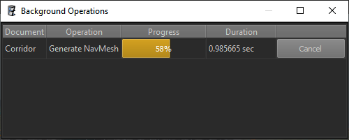

# Editor Background Operations

Most data that takes time to be generated or converted, comes from [assets](../assets/assets-overview.md). However, there is also scene specific data, which does not qualify as an asset. However, generating it can take very long and therefore should only be triggered on demand.

Examples include precomputed lighting or navmeshes. For complex scenes these processes can take very long. Also, if they become out-of-date, this is usually not a big problem immediately, which means updating the data can be delayed until it is really necessary.

Certain components come with such *long operations*. Once you place such a component in a level, the long operation will show up in the *Background Operations* panel:

This panel lists all long operations for all documents. Click *Start* to make one run in the background. Double click a row to jump directly to the component.

**Important:** Background operations are currently never run automatically, it is your responsibility to decide when to execute them.

## See Also

* [Back to Index](../index.md)
* [Assets](../assets/assets-overview.md)
