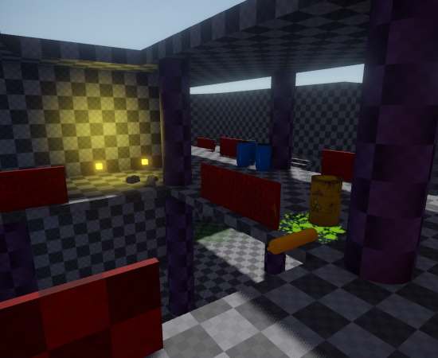
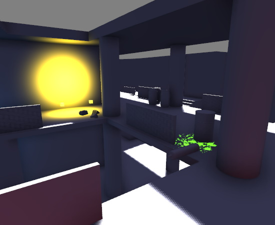
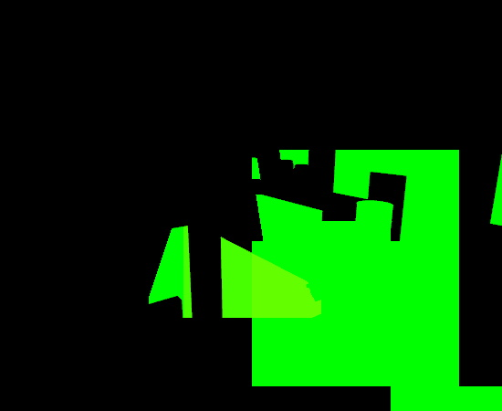
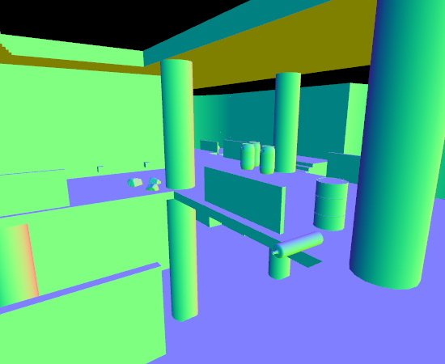
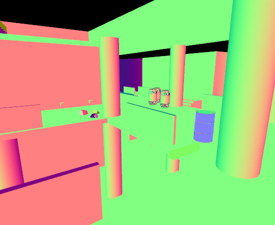
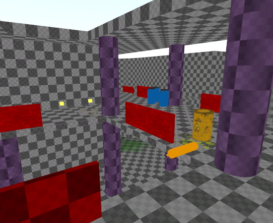
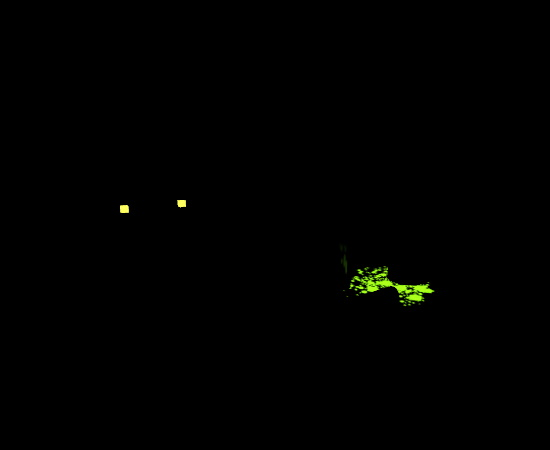
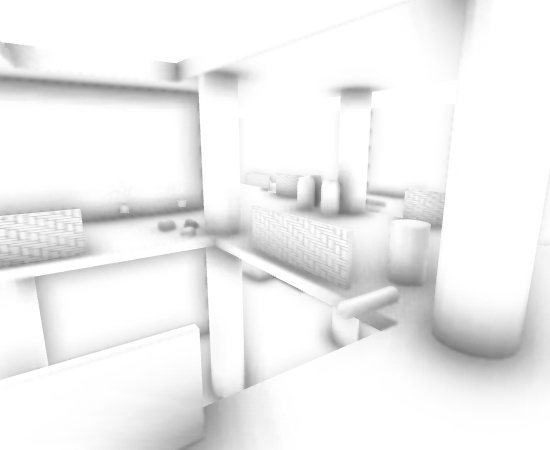
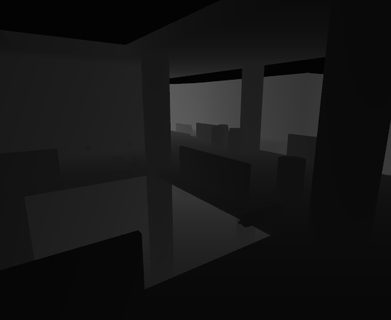
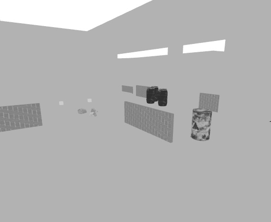

# Editing Views

Most documents come with at least one 3D view. The scene documents allow you to switch between single-view and quad-view mode, using the *Toggle Views* button in each view toolbar.

Using the *Perspective* menu in the toolbar (the *eye* icon) you can switch each view to either orthographic or perspective mode.

[Camera controls](../scenes/editor-camera.md) and [editing gizmos](../scenes/gizmos.md) act differently in orthographic and perspective mode.

## Render Modes

Render modes are used to visualize different aspects of the scene. They can be useful for debugging rendering issues, see potential performance hotspots, or easier edit a dark scene.

Most 3D viewports allow you to switch the rendering mode through a drop down menu.

### Default

This mode renders the scene as it would appear in the final game.

### Wireframe

In this mode the scene is rendered only as wireframe. Either monochrome or colored.

<!--  -->

### Lit

This mode visualizes all lighting contributions.

### Decal Count

Visualizes how many decals affect each pixel. Yellow and red areas indicate high decal overdraw and will affect performance negatively.

### Light Count

Visualizes how many lights affect each pixel. Yellow and red areas have many contributing lights and will affect performance negatively.

### Static vs Dynamic

This mode visualizes which objects in the scene are `static` (green) and which ones are `dynamic` (red). Dynamic objects have a per-frame performance cost, even if they don't move. This mode allows you to find objects that are unnecessarily set to be dynamic.

### Texture Coordinates

There are two modes to visualize the UV0 and UV1 texture coordinates.

### Normals and Tangents

There are multiple modes to visualize normals and tangents, per-vertex and per-pixel.

<!--  -->
<!--  -->

### Diffuse Color

This mode only shows the diffuse color. It can be very handy for editing a scene that is otherwise very dark.

### Diffuse Color Range Check

In `Physically Based Rendering` (PBR) the diffuse color values should never be too dark or too bright, as both will not give the best possible results. This mode visualizes which areas may have non-optimal diffuse colors.

### Emissive Color

This mode visualizes which objects use emissive colors.

### Specular Color

Visualizes the specular color.

### Ambient Occlusion

This mode shows ambient occlusion values. These come both from dedicated AO maps, as well as screen space ambient occlusion (SSAO).

### Depth

Visualizes the depth of all objects. Note that depending on the near and far plane settings and the camera distance to the closest object, this mode may appear nearly entirely black or white. For this screenshot the far plane had to be adjusted.

### Roughness

Visualizes the roughness of objects.

## See Also

* [Back to Index](../index.md)
* [Editor Camera](../scenes/editor-camera.md)
* [Scene Editing](../scenes/scene-editing.md)
