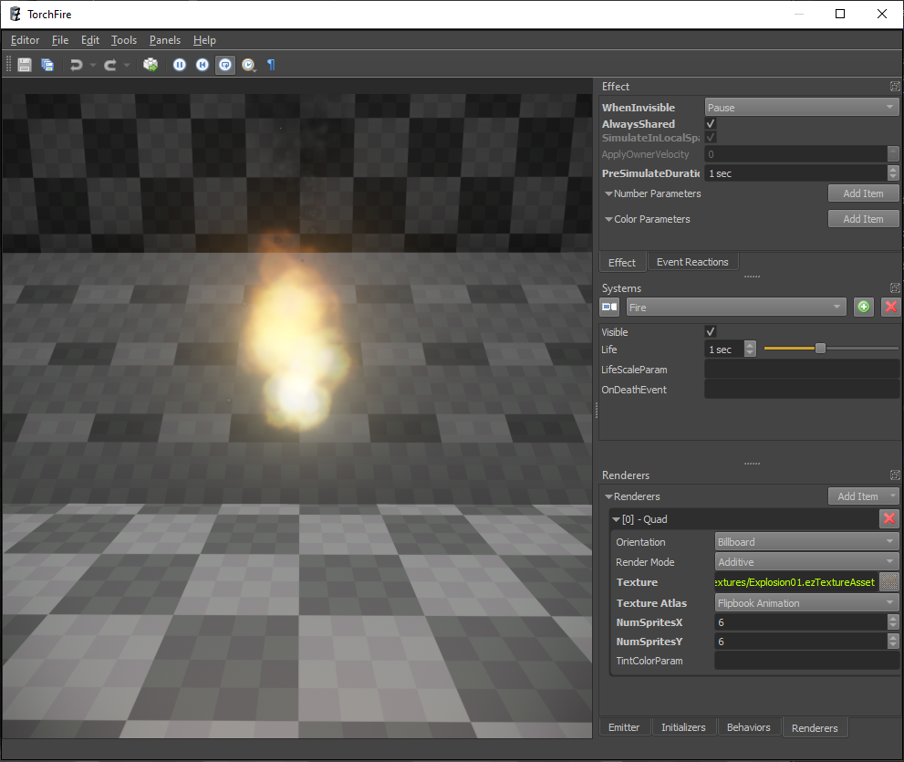
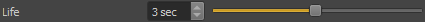

# Particle Effects

<!-- PAGE IS TODO -->

Particle effects are used to create the visual part of things like explosions, smoke, fire, water splashes and much more. They are randomized to have slight variations every time. To create a full effect, like an explosion, with [sound (TODO)](../../sound/sound-overview.md) and physical properties such as pushing nearby objects away or damaging objects and creatures, a particle effect is typically put into a [prefab (TODO)](../../prefabs/prefabs-overview.md), which contains additional components for sound and game play logic (e.g. through [scripts (TODO)](../../custom-code/typescript/typescript-overview.md)).

To create a new particle effect, use *Editor > Create Document* and select *Particle Effect* as the file type. Or alternatively, right-click on any asset in the [asset browser](../../assets/asset-browser.md) and select *New > Particle Effect*.

## Particle Editor UI

This is an overview screenshot of the particle editor:

The 3D viewport plays the effect in a loop. Using the toolbar buttons you can pause, reset, slow down or speed up the playback. On the right hand side there are multiple tabs which hold the various settings of the effect. If you are not too familiar with particle effects yet, please read [how particle effects work](how-particle-effects-work.md).

On the right hand side you see multiple tabbed panels:

### Systems

The **Systems** panel is very central. Here you add new particle systems to the effect. However, this is also where you **select which particle system to edit**. The combo box specifies which particle system is currently active. All panels below (*Emitter*, *Initializers*, *Behaviors* and *Renderers*) show only the settings of the *active particle system*.

When you add a new particle system with the green '+' button, you get a new system that uses a default configuration.

### Effect

The **Effect** panel lists options for the overall effect, independent of the individual particle systems. Adjusting these options is typically only necessary once an effect is working well and you need to tweak its performance or allow users to adjust details through [exposed parameters (TODO)](../../scenes/exposed-parameters.md).

### Emitter, Initializers, Behaviors and Renderers

These panels show the various options for the *active particle system*. When you select a different particle system from the combo box in the *Systems* panel, these panels will show different options.

### Event Reactions

See [events](#events) below.

## Particle System Configuration

Every particle system has exactly one *emitter*, usually multiple *initializers* and *behaviors*, and typically one *renderer*. Most parameters are configured on those parts.

Additionally, every particle system has these properties:

**Visible:** This is an option for testing. If *Visible* is deactivated, the particle system is not simulated or rendered. Use this when you need to focus on editing other systems, or when a particle system is not yet good enough to be used. Invisible particle systems don't cost performance.

**Life:** This is a [value with variance](#variance-values). It specifies how long each particle will be simulated and rendered before it is removed from the system. A low variance means all particles live equally long, a high variance means some will have a short lifespan, others a much longer one.

**LifeScaleParam:** An optional [effect parameter](#effect-parameters) which can be used to scale the particle lifespan.

**OnDeathEvent:** An optional name for the [event](#events) when a particle dies. This can be used to spawn other effects.

### Emitter

The *emitter* is what defines how new particles in this system get spawned. It mostly specifies when and how many particles are spawned. Typically particles are either spawned in one big burst or continuously. However, for advanced use cases the emitter may only spawn particles as a reaction to some [event](#events) or when the particle effect node was moved a certain distance.

For details about all available emitter types, see [Particle Emitters](particle-emitters.md).

### Initializers

Every particle has a number of properties, such as position, velocity, color, size and rotation speed. For a newly spawned particle, these values must get a starting value. *Initializers* allow you to affect the starting value. For example, a particle's position is by default `(0, 0, 0)`, but using a *Sphere Position Initializer*, the starting position will be set to a random position inside a sphere, or even just on its surface.

Initializers are executed exactly once for each new particle, thus they cost little performance. However, they only have an effect, if the starting value isn't subsequently overwritten by *Behaviors*. For instance if the *Random Color Initializer* is used, it will set the color of new particles. If, however, the *Color Gradient Behavior* is also used, the behavior will set the particle's color to a new value in every update, thus making the initializer pointless.

Prefer to use initializers over behaviors, if the desired result can be achieved with either.

For details about all available initializer types, see [Particle Initializers](particle-initializers.md).

### Behaviors

*Behaviors* are the core particle effect update routines. Every time a particle moves, changes color, grows, shrinks or rotates, this is implemented by a behavior. Behaviors are executed for every particle, in every update step. For performance reasons, you should strive to use as few behaviors as possible. Every behavior reads some particle properties and writes one or two properties. For example the *Size Curve Behavior* reads a particles age and maximum lifespan and then looks up its new size from the provided size curve. Therefore it overwrites the particle's *size* property in every update.

*Initializers* set a particle's property once when it is spawned, *behaviors* set (or update) a property continuously. Consequently a behavior may overwrite an initial value, making it redundant. Or it may build on top of the starting value. For example the *Velocity Behavior* can be used to have particles fly upwards (rise). Although the behavior modifies the particle's *position* property, it still works well together with the various position initializers, as it only *adds* to the position instead of replacing it.

It is common for a particle system to have at least one, but often multiple, behaviors.

For details about all available behavior types, see [Particle Behaviors](particle-behaviors.md).

### Renderers

Conceptually a particle is just a point in space. There are many ways this point can be visualized. *Renderers* are used to select how to do that. Most particle systems use one renderer, often the *Billboard Renderer*, which is the most versatile. However, you are free to use multiple renderers. For example to achieve a fire effect with heat haze, you may want to use two renderers. One to render the particles as billboards using a fire texture, and another one to apply the screen space distortion effect.

For details about all available renderer types, see [Particle Renderers](particle-renderers.md).

## Effect Parameters

*Effect parameters* are an advanced feature that allows you to make certain parts of an effect configurable from the outside. You add effect parameters in the *Effect tab*. At the moment only *number parameters* and *color parameters* are supported. All parameters that you add there will appear as [exposed parameters (TODO)](../../scenes/exposed-parameters.md) on [particle effect components](particle-effect-component.md).

Effect parameters can only affect select features. For example the [quad renderer](particle-renderers.md#quad-renderer) has a `TintColorParam` property. If you type in the name of a *color parameter* there, the quad renderer will look up the value of the color parameter during every update, and use that to modulate the final color of the rendered particle.

You can use this in a static way, as a means to add more variety to multiple instances of the same effect. Or you can use this in a dynamic way, by modifying the exposed parameter through (script) code, for example to visualize how hot something burns.

## Events and Event Reactions

Particles may raise *events*. The most common one is when a particle dies, but different particle behaviors can raise other events as well. For example when a particle collides with the environment (see [raycast behavior](particle-behaviors.md#raycast-behavior)).

The **Event Reactions** tab allows you to configure what happens for a specific event. This is mostly used to chain effects. For example the fireworks effect below has particles that represent the rockets flying up, and when one 'dies', an explosion is spawned at that position, using event reactions.

<video src="media/event-reaction-effect.webm" width="500" height="500" autoplay loop></video>

Instead of spawning other particle effects, you can also spawn entire prefabs, which enables even more complex effects.

Every *event reaction* has a *Probability* value which should be between 1 and 100. For example, if one reaction has a probability of 50, then for half of all events, that event reaction will be spawned. If there is no other event reaction for the same event type, then nothing is spawned. If however, another event reaction exists, say with a probability value of 30, then it also gets a chance to be spawned. Since 20 probability points are still not assigned, there is an overall 20 percent chance that no reaction is spawned.

Be aware that probabilities are not normalized across event reactions. If you have two reactions for the same event type, both with a probability of 100, then in practice the first event reaction will always be spawned, and the second one will never be spawned.

Apart from event reactions, it is also possible to react to events using the [OnEvent emitter](particle-emitters.md#onevent-emitter), however, that is less common.

## Misc

### Variance Values

The particle editor presents many values as *values with variance*. They appear as a single value with a slider next to it:

The input box represents the *base value* and the slider represents the *variance*. The variance is between `0` and `1`.

Generally, this type represents a random value, centered around the base value using a [normal distribution](https://en.wikipedia.org/wiki/Normal_distribution). The variance affects the range from which random values are drawn. The range is always between `BaseValue - Variance*BaseValue` and `BaseValue + Variance*BaseValue`. Consequently:

* If `Variance` is `0`, the range and thus the result for every 'random' value will be exactly `BaseValue`.
* If the variance is `1`, the random value will be anywhere between `0` and `2 * BaseValue`.
* For a variance of `0.5`, the random value will be between `BaseValue - 0.5*BaseValue` and `BaseValue + 0.5*BaseValue`

However, due to the *normal distribution* of the random numbers, values close to `BaseValue` will appear much more often than values far away from it. Such distributions are common in nature and therefore the result looks more natural.

For most such values you should use at least some variance (0.2 to 0.4) to make your effects look less repetitive and sterile. However, extremely large variance values (0.7 and up) can result in unexpected outliers.

### Local Space Simulation

TODO

### Owner Velocity Inheritance

In the *Effect tab* there is a property **ApplyOwnerVelocity** which is a value between `0` and `1`. By default the value is zero, which means that all particles are initialized with either a zero velocity or with whatever some [initializer](particle-initializers.md) decided. In that case, particles will fly away from the emitter position unaffected by the velocity of the effect object itself. However, if the value is set to non-zero, a part of the velocity of the owning game object will be added to newly spawned particles.

This can be used for effects that may be spawned from moving objects and that shall retain some of that momentum. However, unless you additionally configure the effect to have some velocity damping (ie. using the *friction* property of the [velocity behavior](particle-behaviors.md#velocity-behavior)), the particles will fly into that direction continuously, which may look weird, especially when the owner object changes direction or brakes, and the spawned particles overtake it.

Other options to keep particles closer to the owning object are to use the [pull along behavior](particle-behaviors.md#pull-along-behavior) or to fully [simulate in local space](#local-space-simulation).

### Shared Effects

TODO **AlwaysShared**

### Pre-Simulation

Some effects are supposed to always look as if they are constantly running. Mostly this is needed for ambient effects, such as torch fire or chimney smoke. The game may only spawn these effects when the player enters an area, but it is not desirable to see them getting started before they reach a stable simulation state. Instead, they should always already be in the state that they reach after a couple of seconds of simulation.

For such cases, you can use the *PreSimulationDuration* option from the *Effects tab*. When this is set to a couple of seconds, the first time an effect is simulated, it will be simulated multiple times, to reach the desired state.

**Note:** Pre-simulation obviously has a performance cost during the first simulation step. Therefore, keep the pre-simulation duration as low as possible.

Also be aware that for many ambient effects, that are instantiated a lot throughout a scene, prefer to use [shared effects](#shared-effects). Pre-simulation may still be necessary to fix their very first appearance, though.

### Invisible Update Rate

When a particle effect is not visible, it may still need to be updated, as the way that it changes may make it visible in the first place. For example the smoke of a smoke grenade that is behind the player may become visible when it is blown into the players view by the wind. It may be sufficient, though, to only update the effect ten times, or even just 5 times per second, while invisible. Thus reducing the computational overhead.

However, there are also effects which do not need to be updated, at all, when invisible. A waterfall effect, for instance, will always look similar. Thus once it is out of view, it can be simply paused.

And there are even effects that can be discarded entirely, when out of view. Bullet impact effects, for example, may be so small and have such a short life span, that there is no value in updating them at all, unless they are visible to begin with.

Which update method to use can be chosen from the *Effect tab* using the **WhenInvisible** property.

## See Also

* [Back to Index](../../index.md)
* [How Particle Effects Work](how-particle-effects-work.md)
* [Particle Effect Component](particle-effect-component.md)
