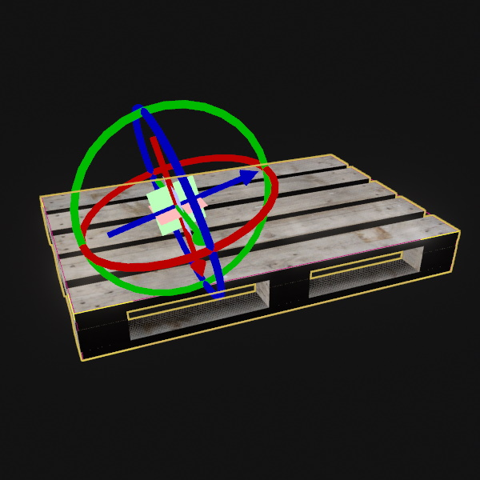

# Grabbable Item Component

The *Grabbable Item* component is used to define points on an object that are good anchor points to pick the object up. The component has no behavior by itself, it only holds data.

Other components, such as the [PhysX grab object component](../physics/special/physx-grab-object-component.md) can utilize this information to improve the experience of picking an object up. Or a game may even only allow objects with this component to be grabbable in the first place.

Both the position and rotation of each grab point are important. The rotation defines how the object will be oriented when it is picked up.

**Note:** The component can be attached to any object, but for example the [PhysX grab object component](../physics/special/physx-grab-object-component.md) expects it to be attached to the same object as the [dynamic actor component](../physics/actors/physx-dynamic-actor-component.md) that has been picked through its raycast.

## Component Properties

* `GrabPoints`: An array holding all the *grab points*. Extend this array to add grab points. Use an item's [manipulators](../scenes/gizmos.md#manipulators) to adjust the position and orientation of a grab point.

## See Also

* [Back to Index](../index.md)
* [PhysX Grab Object Component](../physics/special/physx-grab-object-component.md)
