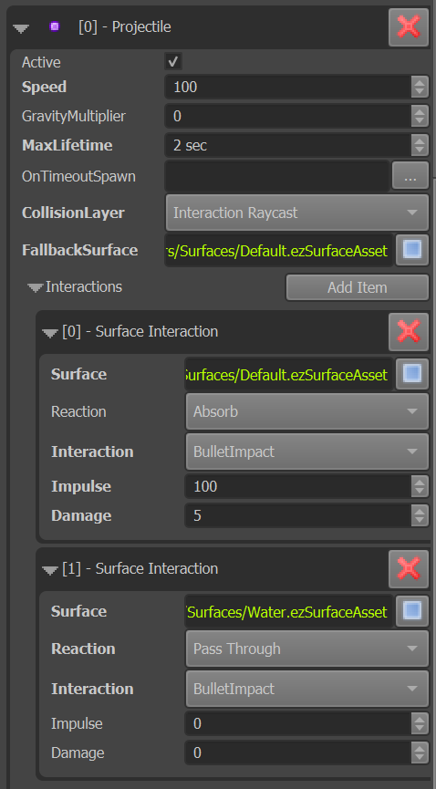

# Projectile Component

The *projectile component* makes an object move along a straight line (with optional gravity), checks for collisions and triggers [surface interactions](../materials/surfaces.md#surface-interactions). It also applies *damage* and a *physical impulse* when it hits something.

There are many ways projectiles may work in different games. The projectile component only implements the most commonly needed functionality. For some games this may already be sufficient. For more creative games you most certainly need to implement your own component. The built-in projectile component is mostly meant as a showcase and demonstration, how you can generally implement such functionality, especially how to interact with [surfaces](../materials/surfaces.md).

## Component Properties

`Speed`: The speed (m/sec) at which the projectile will fly along the +X axis. For dramatic effect it is often more interesting for bullets to fly much slower than is realistic, so that one can see them.

`GravityMultiplier`: How strong gravity should affect the bullet. If set to 0, the projectile will fly straight ahead. With values > 0, it will fall downwards.

`MaxLifetime`: If the projectile lives longer than this, it will destroy itself.

`OnTimeoutSpawn`: If the projectile destroys itself because it didn't hit anything before `MaxLifetime` ended, it will spawn this prefab. Can be used to let rockets 'explode' after a while.

`CollisionLayer`: The physics [collision layer](../physics/collision-layers.md) to use for raycasting whether the projectile hit something.

`FallbackSurface`: If the projectile hits something that has no [surface](../materials/surfaces.md) assigned, it will assume that this type of surface was hit. This just guarantees that you always get any kind of hit response, even when the hit geometry is just dummy or placeholder geometry.

`Interactions`: This array allows you to specify exactly what the projectile will do, when it hits different types of surfaces. Each entry is used to configure the action of the projectile if a certain type of surface is hit. Note that surfaces and surface interactions already work hierarchically. That means for most types of projectiles this array only needs to contain a single entry, with a base surface, and all it needs to specify is what 'interaction' to trigger. The exact type of surface that is hit, will then decide what prefabs to spawn for that kind of interaction.

### Interaction Properties

* `Surface`: The (base) type of surface for which this array element applies.
* `Reaction`: How the projectile itself should react. `Absorb` means it will stop there, `Reflect` means the bullet will bounce off, `Attach` means the bullet will stop but attach itself to the target object and `Pass Through` means it will continue on its path.
* `Interaction`: The [surface interaction](../materials/surfaces.md#surface-interactions) to trigger when the projectile hits this type of surface.
* `Impulse`: The amount of physical impulse to exert on the hit object.
* `Damage`: The amount of damage to apply to the hit object.

## Example

The image below shows a basic bullet projectile setup:

The projectile flies relatively fast, has a short lifetime and uses a collision layer that would hit most physical objects. In the *interactions* array we only have two elements. One is the *default* surface, which is the base surface for all others, that means no matter what type of surface a projectile hits, this entry will always apply, unless there is a more specific entry. As you can see, the bullet is configured to be *absorbed* when it hits anything solid, it will apply some damage and push the object backwards with some impulse. It is also set to trigger the 'BulletImpact' surface interaction. What that means, ie. whether there will be sparks or splinters and what sounds to play, etc, is all configured through the [surfaces](../materials/surfaces.md).

There is a second entry in this array, for when the bullet hits *water*. The main difference here is, that the bullet reaction is set to *pass through*, which means that the projectile will not stop, but continue forwards. It will still trigger the 'BulletImpact' surface reaction, though, so this allows the surface to spawn a water splash effect.

## Conclusion

With these settings you can build a wide variety of interesting projectiles, especially if you use all the flexibility of surfaces and surface interactions. Still, there are many things that are not possible, and you are encouraged to write your own projectile component(s) that suit your needs. The code of the `ezProjectileComponent` is a good starting point for inspiration.

## See Also

* [Back to Index](../index.md)
* [Surfaces](../materials/surfaces.md)
* [Collision Layers](../physics/collision-layers.md)
* [Particle Effects](../effects/particle-effects/particle-effects-overview.md)
