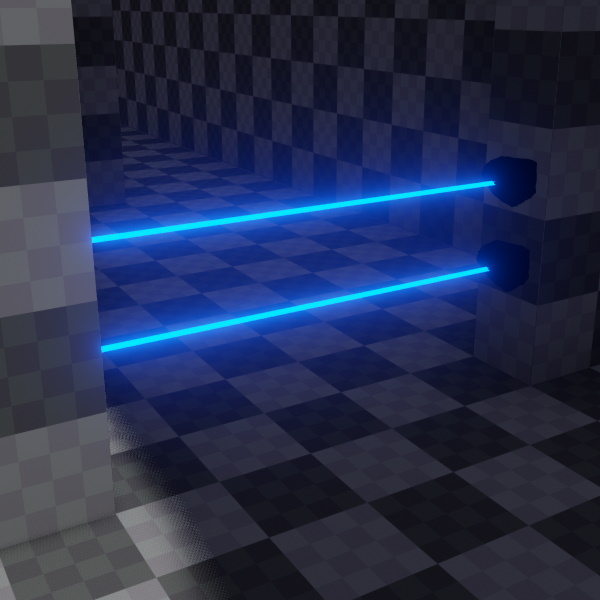

# Raycast Placement Component

The *raycast placement component* does a ray cast and positions a target object there.

The image below shows raycast placement components being used together with a [beam components](../effects/beam-component.md) to create laser beams.

This component does a ray cast along the forward axis of the game object it is attached to. If this produces a hit, the target object is placed there. If no hit is found the target object is either placed at the maximum distance or deactivated depending on the component configuration.

This component can also trigger messages when objects enter the ray. E.g. when a player trips a laser detection beam.
To enable this set the trigger collision layer to another layer than the main ray cast and set a trigger message.

Sample setup:
* `CollisionLayerEndPoint` = Default
* `CollisionLayerTrigger` = Player
* `TriggerMessage` = "APlayerEnteredTheBeam"

This will lead to trigger messages being sent when a physics actor on the 'Player' layer comes between
the original hit on the default layer and the ray cast origin.

## Component Properties

* `MaxDistance`: The maximum distance to do the raycast.
* `DisableTargetObjectOnNoHit`: If set, the `RaycastEndObject` is set to [inactive](../runtime/world/game-objects.md#active-flag) when the raycast hits nothing within `MaxDistance`. This can be used to for things like laser pointers, where the target object represents the 'laser dot'. If the laser pointer hits nothing, the laser dot object should temporarily disappear. Once the raycast hits something again, the component will make sure to reactivate the target object again.
* `RaycastEndObject`: A [referenced object](../scenes/object-references.md) that this component should affect. Every time the placement component determines a different position for the raycast hit, it will move the referenced object there.
* `ForceTargetParentless`: If set, the placement component will make sure that the referenced `RaycastEndObject` will be detached from any parent object. The practical reason for this is, that to prevent multiple objects from modifying the position of the end object, it should have no parent game object, which may pass down its own transform changes. However, when the end object is part of a prefab, it will always have a parent, and that parent may need to move. For example when a weapon is attached to a character controller. Therefore the placement component can take care of detaching the end object at the appropriate time.
* `CollisionLayerEndPoint`: The [collision layer](../physics/collision-shapes/collision-layers.md) to use for the raycast to detect where the `RaycastEndObject` should be placed.
* `CollisionLayerTrigger`: An optional, different [collision layer](../physics/collision-shapes/collision-layers.md) to detect whether a specific type of object is closer than the placed end object. If this is the case, the event `ezMsgTriggerTriggered` is raised, using the identifier given in `TriggerMessage`. This can be used for things like trip mines, where the first collision layer detects how far away the closest wall is, and the second collision layer checks whether any player or NPC has come between the mine and the opposing wall.
* `TriggerMessage`: The trigger identifier message to use when `CollisionLayerTrigger` detects an object.

## See Also

* [Back to Index](../index.md)
* [Beam Component](../effects/beam-component.md)
* [Trigger Component (TODO)](../physics/actors/trigger-component.md)
