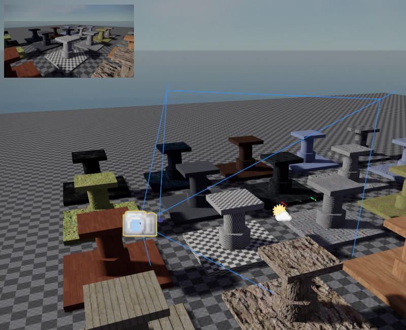

# Camera Component

The *camera component* is used to tell the renderer from which position and with which settings to render the scene. Apart from the component that acts as the *main camera*, there can be additional cameras in active use for [render to texture (TODO)](../effects/render-to-texture.md) effects. Additionally, camera components can be used in the editor as 'bookmarks' to be able to quickly jump to specific positions in a level.

When an object with a camera component is selected, the editor shows a preview of what the camera sees in the top left corner.

## Main Camera

The camera settings that are used for rendering the scene are fully under control of the [game state](../runtime/application/game-state.md). Every frame it decides where to place the main camera and with which settings. At this point, no camera component is involved, your game may control the main camera without having any camera component in the scene.

However, the *default behavior* of the game state (see `ezFallbackGameState`), is to check the scene for a camera component that has its `UsageHint` set to `Main View`. Unless you write a custom game state and override this behavior, the game state will simply copy all the camera settings from the first camera component that it can find with this usage hint.

Consequently, you can control the main camera, by placing a component and setting its `UsageHint` to `Main View`.

If you want a different camera component to take over from the current one, you need to change the usage hint on those camera components.

> **Important:**
>
> The `ezFallbackGameState` is mostly for development and therefore has other convenience features for cameras. For example, you can switch through cameras in the scene using `Page Up` and `Page Down`. If you release a game, you should make sure to disable this behavior.

## Other Cameras

A scene can contain any number of camera components. Unless they are referenced by other systems, they won't do anything and will have no performance impact.

### Camera Bookmarks

Camera components can be placed as 'bookmarks', such that people working on a scene can quickly move the editor camera to areas of interest. [This chapter](../scenes/editor-camera.md#level-cameras) describes how to do so.

## Include/Exclude Tags

By default a camera renders all objects in the scene. Sometimes it can be desirable, though, for a camera to render only specific objects, or to ignore those. For example you may have descriptive labels attached to some objects, which the player can display on demand.

Using the inclusion and exclusion [tags](../projects/tags.md) on the camera, you can control which objects are going to be considered for rendering from this camera view.

* If *any* inclusion tag is set, **only objects with any of these tags** are rendered.
* If an exclusion tag is set, **no object with any of these tags** is rendered.

> **Important:**
>
> Don't forget that [tags](../projects/tags.md) **are not inherited**. You can't hide an object by setting a tag on its parent node.

So for the example with the object labels above, you would assign a 'label' tag to those objects and on your camera you would set 'label' as an exclusion tag. This way those objects are not rendered. When the player wants to see the labels, you would simply remove the exclusion tag from the camera, to make them appear.

> **Important:**
>
> Especially when using *include tags*, be aware that not only meshes, but also light sources (and everything else that's part of the rendering process) are affected by this. If you forget to set the necessary include tags on your light sources, the output will stay dark.

## Render to Texture

Camera components can be used to render their view to a texture, which can then be referenced by a [material](../materials/materials-overview.md) and displayed on any [mesh](meshes/meshes-overview.md).

To enable this mode, the `UsageHint` has to be set to `Render to Texture`. You also need to select a `CameraRenderPipeline`. The render pipeline defines how the scene is rendered and which rendering effects are applied. You need to configure which [render pipelines (TODO)](render-pipeline-overview.md) are available to the cameras in the [asset profiles (TODO)](../assets/asset-profiles.md).

The `RenderTargetOffset` and `RenderTargetSize` allow you to render only to a part of the texture.

Note that rendering to a texture involves additional steps. See the chapter about [render-to-texture (TODO)](../effects/render-to-texture.md) for full instructions.

## Component Properties

* `EditorShortcut`: Used to configure [level cameras](../scenes/editor-camera.md#level-cameras).

* `UsageHint`: A hint what the camera is supposed to be used for. Systems like the [game state](../runtime/application/game-state.md) may use this information to use or ignore this component.

* `Mode`, `FOV`, `Dimensions`: Configure whether this is a *perspective* or an *orthographic* view and how the other options are applied. Field-of-view (FOV) is used for perspective modes, dimensions are used for orthographic modes.

* `NearPlane`, `FarPlane`: The distances for the near and far plane. For best performance keep the far plane distance as low as possible. To prevent *z-fighting* make sure that the near plane is not too close and the far plane is not too far out.

* `IncludeTags`, `ExcludeTags`: See [Include/Exclude Tags](#includeexclude-tags) above.

* `CameraRenderPipeline`: Allows you to select a specific [render pipeline (TODO)](render-pipeline-overview.md) that shall be used to render the output from this camera. Available render pipelines are set up in the [asset profiles (TODO)](../assets/asset-profiles.md).

* `RenderTarget`, `RenderTargetOffset`, `RenderTargetSize`: Only available when `UsageHint` is set to `Render to Texture`.

* `Aperture`, `ShutterTime`, `ISO`, `ExposureCompensation`: These options are currently only used for *tonemapping*. They all affect the final exposure value, which means you can adjust any one of them to change the brightness of the output. In the future these values may be used for motion blur and depth-of-field.

## See Also

* [Back to Index](../index.md)
* [Editor Camera](../scenes/editor-camera.md)
* [Render to Texture (TODO)](../effects/render-to-texture.md)
* [Render Pipeline (TODO)](render-pipeline-overview.md)
* [Asset Profiles (TODO)](../assets/asset-profiles.md)
* [Tags](../projects/tags.md)
