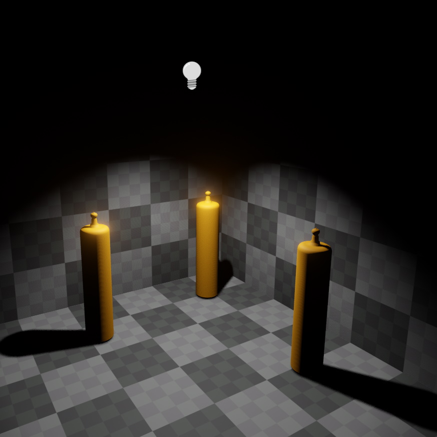

# Dynamic Shadows

Light sources, such as [point lights](point-light-component.md), [spot lights](spot-light-component.md) and [directional lights](directional-light-component.md) may cast dynamic shadows.

The image below shows a spot light casting shadows:

Whether an object casts a shadow depends on whether it has the [tag](../../projects/tags.md) `CastShadow` set.

## Performance

Shadows are implemented using *shadow maps*. That means every light source that shall cast a shadow, has to first render the current scene depth to a texture. This is a very costly operation, which is why you should keep the number of shadow casting light sources as low as possible.

This also is more expensive, the more complex the shadow casting geometry is. Therefore consider switching shadows off for complex geometry and for small objects that don't contribute much anyway. For large complex geometry, you can also use low resolution proxy geometry for casting shadows, though you have to be careful with self-shadowing artifacts if the geometry is very different.

Use your knowledge about the scene to switch shadow casting lights off when they are not needed. For example, if you need a light inside a room to cast dramatic shadows, but the room entrance is only visible from a corridor, use a [trigger (TODO)](../../physics/actors/trigger-component.md) to only switch the light on when the player can actually see the light.

Prefer to use spot lights over point lights, if that makes it possible to get away without shadows in the first place.

All shadow casting light sources share a single shadow texture atlas. Every frame the engine determines the on-screen size of each light source and then allocates some area of the texture atlas to each light source. That means lights that are farther away will use a lower resolution shadow map than close up lights.

## Shadow Quality

Shadow maps are prone to artifacts called *shadow acne*. Either light leaks through objects where there should be shadows, or shadows leak through objects where there should be light. This happens due to precision issues, especially when a shadow is cast nearly perpendicular to a surface. The `SlopeBias` and `ConstantBias` properties (see below) allow to tweak the shadows to reduce this issue in specific places, but there is no solution that will always work.

## Shadow Component Properties

Dynamic light sources such as [directional lights](directional-light-component.md), [point lights](point-light-component.md) and [spot lights](spot-light-component.md) can cast dynamic shadows. These components all have properties to tweak the shadows for quality. The following properties are common to these component types:

* `CastShadows`: If enabled, the light will cast dynamic shadows.

  > **Important:**
  > Casting shadows costs a lot of performance. Make sure to only have a small number of lights with shadows active at any one time, otherwise your game may perform poorly.

* `PenumbraSize`: This value specifies how soft the edge of shadows is supposed to be. The image below shows a penumbra size of `0` on the left and `0.5` on the right:

  

* `SlopeBias, ConstantBias`: TODO

## See Also

* [Back to Index](../../index.md)