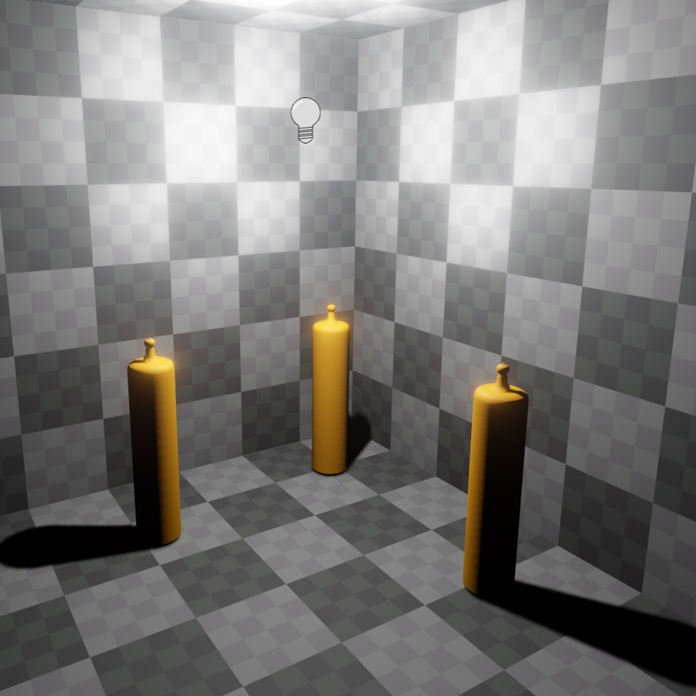

# Point Light Component

The *point light component* adds a dynamic light source that illuminates the scene equally in all directions. This is the most common type of light source.

Each light source costs performance. Try to reduce the number of light sources that illuminate the same area. Use the [light count render mode](../editor/editor-views.md#light-count) to find hotspots.

Note that unless a light source casts [dynamic shadows](dynamic-shadows.md), it's light will shine through walls. Casting shadows is very costly, though. When it is possible to avoid casting shadows, for example by using multiple smaller lights instead, the performance should always be better.

## Component Properties

See [this page](dynamic-shadows.md#shadow-component-properties) for shadow related component properties.

* `LightColor, Intensity`: The color and brightness of the light.

* `Range`: The distance over which the light source affects geometry. By default this is set to `Auto`, meaning the necessary range will be computed from the light's brightness. For full control, the range can be set manually. The light will always attenuate to zero within the given range, so by specifying a small range you can create a small, yet very bright light.

## See Also

* [Back to Index](../../index.md)
* [Lighting (TODO)](lighting-overview.md)
* [Spot Light Component](spot-light-component.md)
