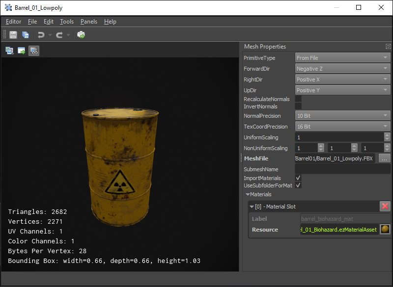

# Mesh Asset

A *mesh asset* represents a mesh that can be used for rendering. In the most common case the mesh asset imports the mesh data from an external file, such as an FBX file. However, it also supports generating the mesh data for common shapes (spheres, cylinders, ...) procedurally. Mesh assets are typically added to a scene with a [mesh component](mesh-component.md).

The left hand side of the [asset document](../../assets/assets-overview.md) shows a 3D preview of the mesh. The viewport allows to switch the [render mode](../../editor/editor-views.md#render-modes) to inspect the mesh normals, UV coordinates and so on.

On the right hand side the asset properties specify how to import or generate the mesh data.

> **Important:**
>
> The mesh asset does not automatically update when you edit its properties. Instead you need to *transform* the asset (`Ctrl+E` or with the rightmost button in the toolbar).

## Asset Properties

* `PrimitiveType`: This selects how the mesh data is generated. If `From File` is chosen, you need to also specify the `MeshFile` property. If you choose a procedural method, other configuration options appear.

* `ForwardDir`, `RightDir`, `UpDir`: With these you can change which axis is considered forward, right and up in the mesh data. For  mesh data from FBX files, this information is typically embedded in the file. For other file types, you may need to adjust these to make the imported data appear correctly upright.

* `RecalculateNormals`: If enabled, information about normals in the mesh file is ignored, and instead the normals are recomputed.

* `InvertNormals`: If enabled, normals get negated to point into the opposite direction.

* `NormalPrecision`, `TexCoordPrecision`: These options allow you to choose how precise normals and UV coordinates are represented. Leave these at the default, unless you notice precision issues. Higher precision means the mesh takes up more RAM on the GPU and is slightly slower to render.

* `(Non-)UniformScaling`: Using these scaling factors you can adjust the size of the mesh, for example to convert a mesh from centimeter to meter scale.

* `SubMeshName`: If a mesh file contains multiple named meshes, you can choose to only import a single sub-mesh by giving its name here.

  > **Note:**
  >
  > This option hasn't been tested or used in a long while and may not work (well). Also its usability is not great. If you have need for such a feature, feedback and improvements are welcome.

* `ImportMaterials`, `UseSubfolderForMaterials`: If enabled, the mesh import automatically generates [material assets](../../materials/materials-overview.md) for the materials that the mesh file specifies. It also tries to populate those materials with sensible values and if possible also creates [texture assets](../textures-overview.md). Unfortunately this rarely works perfectly, and typically requires you to fix the generated assets afterwards. If `UseSubfolderForMaterials` is checked, those generated assets are stored in a dedicated sub-folder.

  > **Note:**
  >
  > Materials are only generated when the mesh has no materials set yet. After the initial creation of these other assets, you usually need to **transform the mesh a second time** to make them properly show up.

* `Materials`: The list of [materials](../../materials/materials-overview.md) to use. The mesh may have multiple *sub-meshes*, and each sub-mesh uses a different material slot. [Mesh components](mesh-component.md) can override which material is used for which slot.

## See Also

* [Back to Index](../../index.md)
* [Meshes (TODO)](meshes-overview.md)
* [Materials](../../materials/materials-overview.md)
* [Assets](../../assets/assets-overview.md)
* [Asset Import](../../assets/import-assets.md)
