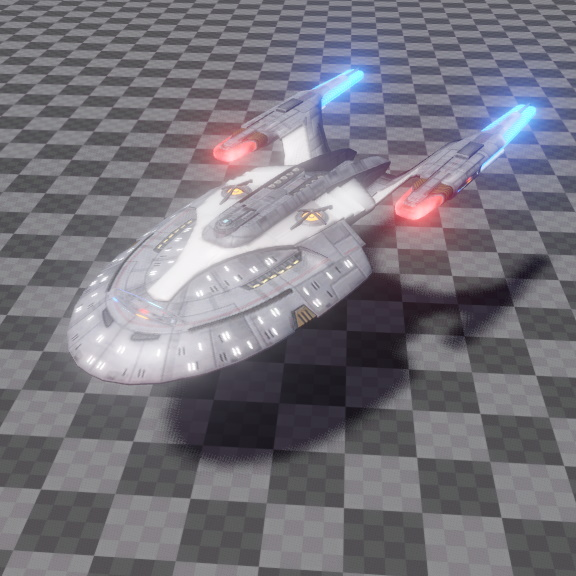

# Mesh Component

A *mesh component* is used to instantiate a [mesh asset](mesh-asset.md). Mesh components are purely visual, they have no physical interaction, so other physical objects cannot collide with them. To add physical interaction capabilities, an object has to have an additional [collision shape (TODO)](../../physics/collision-shapes/shapes.md) and a static or dynamic [physics actor (TODO)](../../physics/actors/actors.md).

Mesh components will cast [shadows](../lighting/dynamic-shadows.md) when the `CastShadow` [tag](../../projects/tags.md) is set on the owner game object. The referenced mesh is rendered according to the used [materials](../../materials/materials-overview.md), which determine [lighting](../lighting/lighting-overview.md) and other visual effects.

## Component Properties

* `Mesh`: The [mesh asset](mesh-asset.md) to render.
* `Color`: A tint color for the mesh instance. Typically this is just multiplied into the diffuse color of the mesh [materials](../../materials/materials-overview.md), though if the material uses a [visual shader (TODO)](../../materials/visual-shaders.md), the mesh color can be used to represent arbitrary input data, for example to blend between material states.
* `Materials`: By default the referenced mesh is rendered with the materials that are set up inside the mesh asset. However, the mesh component can override the materials. Each mesh has one or many *sub-meshes*, meaning mesh parts that use different materials. This array allows to set an override for each of those sub-meshes.

## See Also

* [Back to Index](../../index.md)
* [Meshes](meshes-overview.md)
* [Materials](../../materials/materials-overview.md)
* [Lighting](../lighting/lighting-overview.md)
