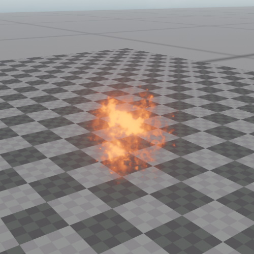

# Sprite Component

The *sprite component* is used to render a textured quad that always faces the camera and whose on-screen size never exceeds a defined limit. Sprites are mainly used to place 3D icons or markers in the world. For example all the [shape icons](../scenes/selection.md#shape-icons) in the editor are sprites. However, they can also be used for simple effects, for instance to represent small projectiles.

Although sprites have a world space size, their on-screen size is clamped to a maximum value. That means they won't fill up the screen when the camera comes very close.

## Component Properties

* `Texture`: The [texture](textures-overview.md) to use.

* `BlendMode`: How to blend the sprite with the background.

* `Color`: A tint color to multiply into the texture.

* `Size`: The actual size of the sprite in the world. Based on this, the screen space size is computed. This mostly affects how large the sprite appears from far away.

* `MaxScreenSize`: The maximum size of the sprite on screen. When the camera is close to the sprite, it will not fill up the entire screen. Instead, its on-screen size is clamped to this. Therefore, when getting close to a sprite, it appears to shrink.

* `AspectRatio`: The ratio of width to height of the sprite texture.

## See Also

* [Back to Index](../index.md)
