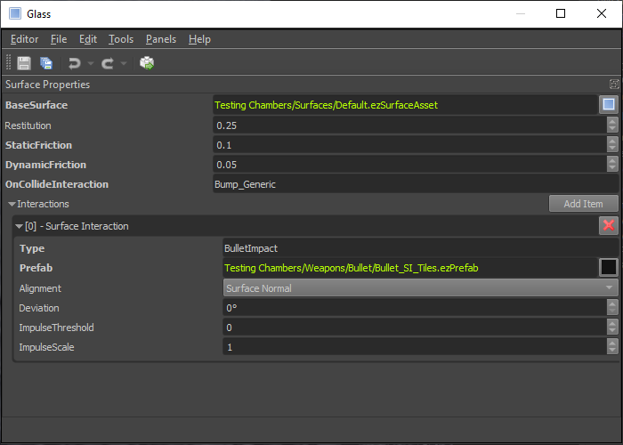

# Surfaces

*Surfaces* are assets that define the physical properties of objects. This includes both the actual physics parameters such as friction, but also how objects interact from a gameplay perspective. For example, surfaces define what sounds are played when objects slide or roll around and what effects should be spawned when there is an impact on an object.

Surfaces and [materials](materials-overview.md) are related. Materials are used to define the appearance, surfaces define the behavior. However, you may have hundreds of materials in a project, but typically only tens of surfaces. The main reason for this is that you may have many different wood textures that look different, but they will all behave the same way. Therefore you only need one surface defining the properties of wood, but many different materials for each wood texture.

The image above shows a surface for glass. Each surface stores a small number of general parameters. Additionally there is an array of *surface interactions* which may hold many entries. These are the key to configuring what effects get spawned when you shoot something, what sounds and effects are spawned when objects collide, what footstep sounds the player makes, and so on.

## Physics Properties

Surfaces are used by [collision meshes](../physics/collision-meshes.md) and other physics components to look up basic physics properties.

**Restitution:** Configures how "bouncy" a material is. Objects with a high restitution will bounce very strongly (like rubber) and objects with a low restitution will come to rest quickly (like soft wood).

**Friction:** The friction values affect how slippery a material is and thus how much it will slide or roll. Smooth surfaces typically have lower and rough surfaces higher friction. PhysX also differentiates between *static* friction for objects that are currently standing still and *dynamic* friction for objects that are already moving. Static friction is typically higher than dynamic friction, meaning it is more difficult to get something to move, than to keep something moving.

## Surface Interactions

The main feature of surfaces are *surface interactions*. These are used to tell the engine which effects it should spawn when a surface interacts with something else. The other thing may be another surface, for example when a box slides over the ground, then both the box and the ground have a surface. However, the other thing could also be something entirely different. For example a laser beam. In this case the surface may define whether the beam should create sparks or fire or steam, etc.

Every surface interaction is configured by adding an entry to the *Interactions* array (see image above). Each entry represents one way that the surface can interact with something else. To determine which interaction to use, for instance when you shoot an object, you specify a *Type* string.

### Triggering Interactions

Interactions are triggered by different systems. The [physics engine (TODO)](../physics/physx-overview.md) triggers interactions when objects collide with enough force. Components, such as the [projectile component](../gameplay/projectile-component.md) trigger interactions when they hit something. The [character controller (TODO)](../physics/character-controller.md) component triggers an interaction with the ground every time the player moved a certain distance (for footsteps). There are many ways that both built in code, as well as custom code can leverage surface interactions to spawn effects. Having the configuration defined by the surfaces, and not by the components themselves, decouples and centralizes this information and makes maintaining and changing this configuration a lot easier.

> **Example:** If you want to shoot something in your game, you need a prefab that represents every type of projectile. You may have regular bullets and laser shots. The two types should result in different effects when hitting various surfaces, e.g. bullets create debris, lasers make burn marks. ez comes with a [projectile component](../gameplay/projectile-component.md) which implements the functionality to move an entity forwards each frame and check the world for collisions. When it collides with something, it will apply damage and a physical impulse. The projectile component does not, however, specify what kind of effect to play when it hits something. Instead, each type of projectile is given a string what *type of interaction* to do when it hits a surface. So our *bullet* projectile would use the `BulletImpact` interaction, and our *laser* projectile would use the `LaserImpact` interaction. Then when a projectile hits an object, it first looks up what type of *surface* it hit exactly. Then it queries that surface for an interaction entry with the desired name. If such an entry exists, it spawns the referenced prefab at the point of impact.
>
> In the image above there is an interaction with *Type* set to `BulletImpact`. This entry references a prefab which, when instantiated, will play a particle effect and a sound that looks like a bullet hit glass. Consequently, when we now shoot at such a surface with a *bullet*, it will act believable. There is no interaction set up for `LaserImpact`, so if we were to shoot a *laser* at this type of surface, the projectile would stop there and apply damage to the hit object, but it would not spawn any kind of effect.

### Spawning Prefabs

All surface interactions ultimately spawn [prefabs](../prefabs/prefabs-overview.md). So if you want to have different footstep sounds when walking over stone, sand and mud, you need three prefabs, each playing a different sound. However, since they are prefabs, your creativity is not limited to playing a sound. Your "sand footstep effect" may contain spawning a small dust [particle effect](../effects/particle-effects/particle-effects-overview.md). And the "mud footstep effect" could additionally spawn a footprint [decal](../effects/decals.md).

The following options allow you to adjust how prefabs are spawned:

**Alignment:** Defines how the spawned prefab instance will be rotated. The +X axis of the prefab is considered to be 'forwards'.

* **Surface Normal:** The 'forwards' direction (+X) of the prefab will be aligned with the normal of the object where the interaction happened. With this mode, the angle at which you shoot at a surface would not make a difference, as the effect is always spawned orthogonal to the hit geometry.
* **Incoming Direction:** For things like bullets, this is the direction at which the surface was hit. So the 'forwards' direction of the spawned prefab would be directly dependent on the angle at which a shot hit the surface.
* **Reflected Direction:** The *incoming direction* reflected at the normal of the geometry.
* **Reverse Normal/Direction:** Same as the other three modes, just the opposite direction.

Note that depending on which system triggers the interaction, there may or may not be a 'direction' associated with it, so the 'Incoming' and 'Reflected' mode may be identical to the 'Normal' mode.

**Deviation:** An optional amount of random deviation away from the spawn direction. This allows you to randomize the spawn direction.

### Hierarchical Surfaces

Interactions are often the same across many types of surfaces. A laser shot may leave a burn mark on pretty much any surface, except glass and water. Setting up the same effect cross many surfaces can be tedious and error prone, especially if you need to adjust it later on. Therefore surfaces allow you to configure them in a hierarchical way where you specify common behavior in *base surfaces* and either add or override specific behavior only for *derived* surfaces.

In the example image above you can see that the *glass surface* has a `BaseSurface` specified, which references *Default.ezSurfaceAsset*. What this means is that if some system (let's say the [projectile component](../gameplay/projectile-component.md)) looks up an interaction like `BulletImpact` on a surface and does not find it on the surface directly, it will then go to its `BaseSurface` and try to look up the interaction there. This can go through multiple steps until it either found the desired interaction, or it reached the last base surface and still found nothing.

This way you can set up many generic interactions on a common base surface and override specific interactions only where needed. This also helps to quickly prototype for example a new gun: you add a generic interaction for the gun type to the base surface and immediately get some feedback on all surfaces. Then you can step by step flesh out how the gun will affect different surface types, by overriding the interaction type on derived surfaces one by one.

### Physics Interactions

Dynamic [physics objects (TODO)](../physics/physx-overview.md) can have three types of interactions with surfaces:

1. They can *bump* into each other
1. They can *slide* across a surface
1. They can *roll* around

Surface interactions enable you to let these make sounds or play effects.

> **Important:**
> At the time of writing only the object collisions (bumping into each other) are configurable. See issue [#231](https://github.com/ezEngine/ezEngine/issues/231).

#### Bump

Each surface has an `OnCollideInteraction` property. This string specifies which surface interaction to trigger on another surface, when two objects collide.

For example the *wood surface* may set its `OnCollideInteraction` property to `Bump_Wood`. When you now have a wooden box and let that box fall onto a stone floor, the physics system will look up the `OnCollideInteraction` property from the dynamic object (the box) and use the string ("Bump_Wood") to trigger this interaction from the stone surface. If the stone surface defines such an interaction, the corresponding prefab will be spawned, otherwise nothing happens.

Now this behavior would trigger an interaction every single time the box touches anything and it would always be the same interaction, no matter whether it just touches something lightly, or collides with a lot of force. To fix this, each interaction additionally has an `ImpulseThreshold`. This allows you to set up multiple surface interactions of the same *type* that have different *thresholds* and reference different prefabs. If an object bumps into another object, the physics engine provides the amount of force with which the collision occurred. The system will then pick the surface interaction with the highest exceeded threshold. Thus if two objects collide with a lot of force, it may spawn a prefab with a loud sound, and if they collide with little force a quieter prefab may be spawned. And if they collide with even less force, no prefab may be spawned at all.

Note that looking up surface interactions is generally [hierarchical](#hierarchical-surfaces), meaning that if something like `Bump_Wood` is not part of a derived surface, but part of its *base surface*, it will be found. However, regarding the *impulse threshold* property, the search is not fully hierarchical. Instead, once any interaction of the right type is found in any (base or non-base) surface, no further search is done in additional base surfaces, even if there would be a surface interaction with a better matching threshold in the base surface.

Basically, once a surface overrides a surface interaction, it completely replaces all available interactions of that type and should have full control which interaction is taken at which threshold.

<!-- TODO ImpulseScale -->

#### Slide

See issue [#231](https://github.com/ezEngine/ezEngine/issues/231).

#### Roll

See issue [#231](https://github.com/ezEngine/ezEngine/issues/231).

## See Also

* [Back to Index](../index.md)
* [Materials](materials-overview.md)
* [PhysX Integration (TODO)](../physics/physx-overview.md)
* [Sound (TODO)](../sound/sound-overview.md)
