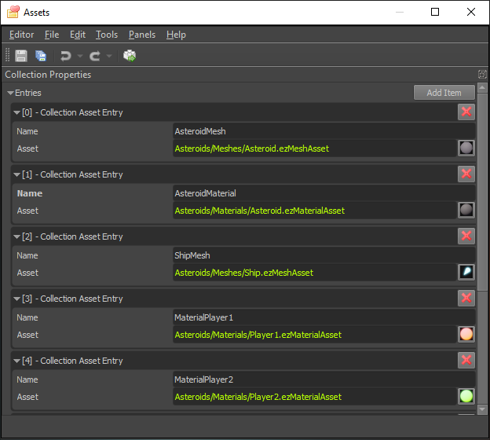

# Asset Collections

A *collection asset* references other [assets](../assets/assets-overview.md). Its main purpose is to control which assets should be made available (loaded in the background) to prevent performance issues. Additionally, each referenced asset can be assigned a name, which makes it possible to load that asset by that name, instead of by its GUID.

A collection asset is a simple list of references. The name property for the entries is optional.

## Preloading Assets

If you need full control, a [game state](../runtime/application/game-state.md) can load an `ezCollectionResource` and call `ezCollectionResource::PreloadResources()` to make certain assets available. A typical use case when you would do this, is when there are certain assets that are always needed in your game. For example, your game may already start loading all the player related assets in the background, while it displays the game's splash screen and main menu.

Another option is to insert a [collection component](collection-component.md) into a scene or [prefab](../prefabs/prefabs-overview.md). If the component is active, that means it will automatically preload the assets from the referenced collection. Doing this makes sense when a script triggers actions that depend on assets, which are otherwise not loaded. If those assets are not preloaded, they will be loaded on demand, which may result in performance hiccups or visual glitches (if a loading fallback resource is used for a while).

## Keeping Assets Loaded

Some assets are only ever needed for brief periods of time, for example particle effect textures. As long as no such effect is playing, their textures are not referenced and the [resource manager (TODO)](../runtime/resource-management.md) may decide to unload them. The next time those assets are needed, they will be loaded again either resulting in a stall, or a visual glitch.

To prevent this, you can create a collection with all the assets that you consider vital, and place a collection component in your scene or prefab. The collection will not only preload those assets, but also hold a reference to each one, preventing them from being unloaded.

## Referencing Assets by Name

Usually, if you want to load a resource from code, you need to know the [asset GUID](../assets/assets-overview.md#asset-guid). If you loaded that asset through a collection, and the collection gave a *name* to that asset, you can also load that asset by that name instead. See the code of the [Asteroids sample](../samples/asteroids.md) as an example.

Not only can this be more convenient, it also allows you to switch which asset will be loaded under the given name, by modifying the collection, or even by having multiple collections, and loading one or another.

## See Also

* [Back to Index](../index.md)
* [Collection Component](collection-component.md)
* [Resource Management (TODO)](../runtime/resource-management.md)
