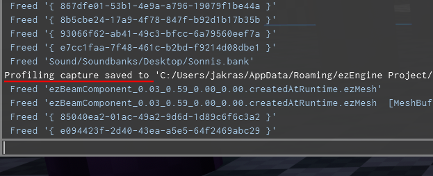
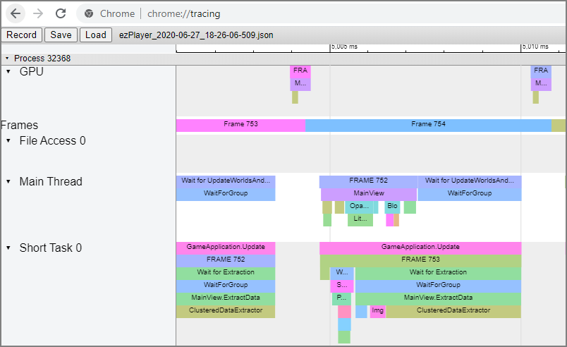

# Profiling

Profiling an application means to record information about its performance to analyse where time is wasted and figure out how to make things faster.

## Capturing Profiling Data

ezEngine has a built in profiling system with which you can record the function call graph, across all active threads, with precise timing information. The profiling system is very efficient, which is why in development builds it is constantly recording data to a ring buffer, which allows you to write recent profiling data to disk at any time. That means whenever you encounter a situation with bad performance, you can just press a button (in stock [applications (TODO)](../runtime/application/application.md) such as [ezPlayer](../tools/player.md) it's the `F8` key) to save a snapshot.

The application will write to the [log](../debugging/logging.md) where it stored the profiling snapshot. You can see this in the [console](../debugging/console.md):



You can reach this folder easier by typing `%appdata%` into the address bar of Windows Explorer.

You can also store a capture yourself through `ezProfilingSystem::Capture()`.

## Investigating a Profiling Snapshot

The profiling data is stored as a JSON file in [Chrome Tracing Format](https://docs.google.com/document/d/1CvAClvFfyA5R-PhYUmn5OOQtYMH4h6I0nSsKchNAySU/preview). To inspect the file, you need to have [Google Chrome](https://www.google.com/chrome/) installed.

1. Type `chrome://tracing` into the address bar
1. Click `Load` and select the profiling data file

You should now see something like this:



Each block represents a profiling scope (typically a function call). Blocks below other blocks represent nested scopes. When you select a block, Chrome displays the time it took. You can scroll and zoom the view.

> **Important:**
>
> The `chrome://tracing` view has a very particular method for navigation. Apart from the obvious modes that you can select with the mouse, the default way is actually to use the WSAD keys. `W` and `S` are used to zoom in and out. `A` and `D` are used to scroll left and right. Use the mouse wheel to scroll up and down. If you manage to get used to this, it is much more convenient than the other methods.

## Profiling Custom Code

If you have custom C++ code that you want to profile in more detail, all you need to do is to insert profiling macros into each scope that you want to profile:

```cpp
void MyFunc()
{
    EZ_PROFILE_SCOPE(MyFuncScope);

    // ... do stuff ...
}
```

This introduces a *profiling scope*, here with the display name 'MyFuncScope'. The time it takes to reach the end of the scope, starting at the macro, will be timed and recorded.

If your scope makes rendering calls for which you want to record the GPU timings, use `EZ_PROFILE_AND_MARKER`.

> **Important:**
>
> Many profiling scopes end up taking only very little time. Inspecting those is rarely useful, but each recorded entry takes up valuable space in the ring buffer of the profiling system. Therefore the profiling system automatically discards information about scopes that fall below some threshold. That means your custom scope may not show up in the output. If you do want to see even very short scopes, you can adjust the threshold either through `ezProfilingSystem::SetDiscardThreshold()` or through the [CVar](../debugging/cvars.md) `g_ProfilingDiscardThresholdMs`.

## See Also

* [Back to Index](../index.md)
* [Debugging C++ Code](../debugging/debug-cpp.md)
* [ezInspector](../tools/inspector.md)
* [Chrome Tracing as Profiler Frontend](https://aras-p.info/blog/2017/01/23/Chrome-Tracing-as-Profiler-Frontend)
