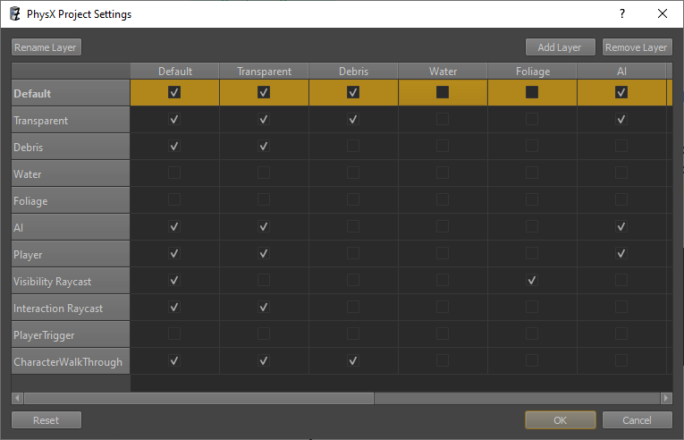

# Collision Layers

*Collision layers* are a concept used by physics engines to decide which objects should collide with which other objects. For instance, a box thrown into a scene should obviously collide with the scene geometry. There may, however, be things that it should not collide with. For example, you may have triggers that should only be triggered by the player or NPCs, but not by other objects. Collision layers can be used to solve this problem.

## Collision Layer Matrix

Collision layers are evaluated by the physics engine and are therefore the fastest method to reject collisions. Filtering out objects that entered a trigger could be done on a higher level, but having the physics engine filter them out early is best for performance.

Due to this, there is a limit of 32 available collision layers. If you require more, you need to rethink your setup and maybe use other methods to handle certain cases.

Each layer can be set to collide or not collide with each other layer. Consequently, the available combinations form a matrix of 32x32 entries. Each entry is either enabled or disabled. The matrix is mirrored along the diagonal. If layer `A` is set to collide with layer `B`, then of course layer `B` has to be set to collide with layer `A`.

For convenience, in the editor you can give a name to each layer. The name is irrelevant at runtime, though.

Under *Editor > Project Settings > PhysX Project Settings...* you can configure the PhysX collision layers, as seen above.

## Physics Actors and Shapes

All physics shapes are in exactly one collision layer. Sometimes this has to be specified on the shape directly, sometimes on the parent actor. When two shapes overlap, the physics engine will check their collision layers. If the pair of layers is configured to collide, the two shapes will interact. Otherwise they will pass right through each other.

## Raycasts and Shape Queries

When doing a raycast or other shape query, you also need to provide a collision layer to determine with which physics shapes the ray should collide. Therefore you often need additional collision layers to implement common operations. For example, you may need a layer to handle 'visibility checks'. Those rays should pass through transparent objects, as glass windows should not block the AI from seeing the player. On the other hand, if you want to 'interact' with the scene, you need a different collision layer, one that would not pass through transparent objects but maybe ignore other types of objects. Combinations can quickly add up and therefore you must consider very carefully what filtering must be done by the physics engine already, and what additional filtering could be done in your own code.

## See Also

* [Back to Index](../index.md)
* [PhysX Integration (TODO)](physx-overview.md)
* [Collision Meshes](collision-meshes.md)
