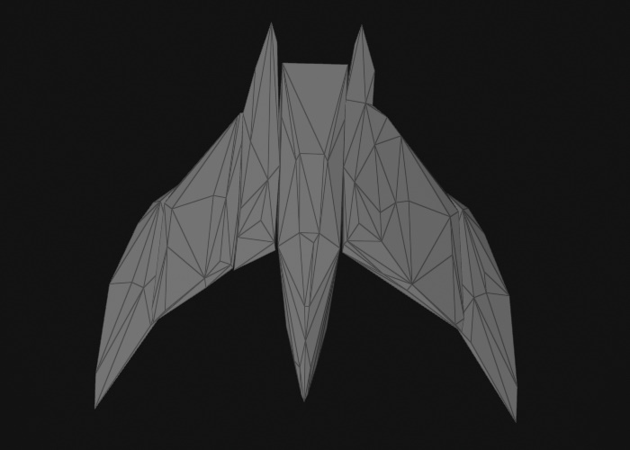

# Collision Meshes

Collision meshes are special [meshes](../../graphics/meshes/meshes-overview.md) that are used by the physics engine to compute physical interactions. Their internal representation is optimized to speed up this task. Additionally, physics engines generally distinguish between two types of meshes: *convex* meshes and *concave* meshes. While concave meshes can represent any arbitrary geometric shape, they can only be used for static [physics actors](../actors/physx-actors.md), which limits them to be used for the static level geometry. Convex meshes are often an oversimplification of the original mesh. However, they can be used for all physical interactions.

## Concave Collision Meshes

To create a concave collision mesh, use the asset type *Collision Mesh* (`ezCollisionMeshAsset`) when [importing an asset](../../assets/import-assets.md).

The image above shows a mesh imported as a concave collision mesh. As you can see it represents every detail faithfully. Due to this complexity, the model can only be used for static [physics actors](../actors/physx-actors.md), meaning you can place it in a level, scale and rotate it, but you may not move it dynamically during the game and it cannot be used to simulate a rigid body. The complexity of a mesh has direct impact on the performance of the game. Especially small details may result in large computational costs when dynamic objects collide with those detailed areas. If you want to optimize performance, you should author dedicated collision meshes with reduced complexity, instead of using the render mesh directly.

Concave collision meshes are set directly on the [static physics actor](../actors/physx-actors.md) component and have no dedicated [physics shape](physx-shapes.md) component.

## Convex Collision Meshes

The simulation of [dynamic actors](../actors/physx-dynamic-actor-component.md) is only possible with convex shapes. To create a convex collision mesh, use the asset type *Collision Mesh (Convex)* (`ezConvexCollisionMeshAsset`) when [importing an asset](../../assets/import-assets.md). To attach a convex mesh to an actor, use the [Convex Mesh Shape component](physx-convex-shape-component.md).

There are multiple modes how to create the convex collision mesh:

### Convex Hull

In the image above the mesh import computed the *convex hull*. The number of vertices and triangles was also reduced to less than 250 (a requirement by PhysX).

Obviously, the mesh lost all of its details and the object will not collide with its surroundings according to its actual geometry, but in many use cases that won't be obvious. This is the most efficient way to use an arbitrary mesh as a collision mesh, as it will always use exactly one, very low poly convex mesh for the physics calculations.

### Convex Decomposition

In the image above the mesh import decomposed the mesh into multiple pieces (seven pieces in this case). Each piece is a convex mesh with less than 250 vertices and triangles.

This mode allows you to dictate into how many pieces to split the mesh. The more pieces, the closer the result resembles the original shape. These collision meshes can still be used for dynamic simulation, the PhysX actors simply use multiple convex shapes as their representation. Of course the more pieces such a mesh contains, the less efficient the simulation becomes.

### Cylinder

Cylindrical shapes are common in games, but since they are not supported as first class shapes by most physics engines, the convex mesh asset allows you to create such collision meshes procedurally.

## Visualizing Collision Meshes

Sometimes you want to visualize the collision mesh of an object within a scene. The most powerful way to look at physics objects is to use the [PhysX Visual Debugger](../physx-visual-debugger.md). However, for some use cases you can also just attach a *Collision Mesh Visualization* component (`ezPxVisColMeshComponent`). This renders the collision mesh into your scene the same way as in the images above.

## See Also

* [Back to Index](../../index.md)
* [PhysX Integration](../physx-overview.md)
* [Physics Shapes](physx-shapes.md)
* [Physics Actors](../actors/physx-actors.md)
* [Collision Layers](collision-layers.md)
* [PhysX Visual Debugger](../physx-visual-debugger.md)
