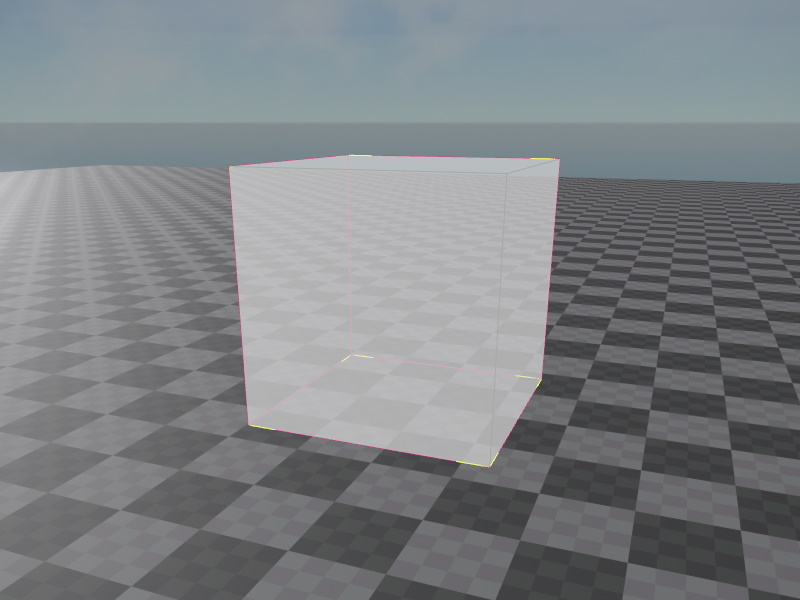

# PhysX Box Shape Component

The *PhysX box shape component* adds a box as a [shape](physx-shapes.md) to the [PhysX actor](../actors/physx-actors.md) that is attached to the closest parent node.

You can attach this component to the same node where the actor component is attached, or you can create a child object to attach it to, which allows you to position the shape relative to the actor.

Boxes are relatively efficient for the physics engine to handle. Prefer them over the [convex shape component](physx-convex-shape-component.md) when possible.

## Component Properties

* [Shared Shape Component Properties](physx-shapes.md#shared-shape-component-properties)
* `Extents`: The width, height and depth of the box shape, from its center position.

## See Also

* [Back to Index](../../index.md)
* [PhysX Shapes](physx-shapes.md)
* [PhysX Actors](../actors/physx-actors.md)
