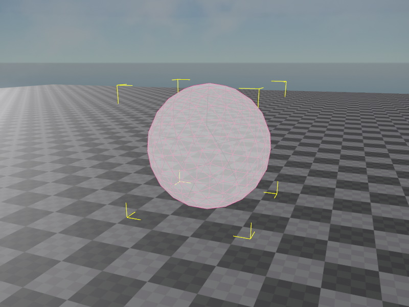

# PhysX Sphere Shape Component

The *PhysX sphere shape component* adds a sphere as a [shape](physx-shapes.md) to the [PhysX actor](../actors/physx-actors.md) that is attached to the closest parent node.

You can attach this component to the same node where the actor component is attached, or you can create a child object to attach it to, which allows you to position the shape relative to the actor.

Spheres are very efficient for the physics engine to handle. Therefore you should prefer them over all other shapes, especially [convex shapes (TODO)](physx-convex-shape-component.md), when you can approximate the geometry of an object with one or a couple sphere shapes.

## Component Properties

* [Shared Shape Component Properties](physx-shapes.md#shared-shape-component-properties)
* `Radius`: The radius of the sphere shape.

## See Also

* [Back to Index](../../index.md)
* [PhysX Shapes](physx-shapes.md)
* [PhysX Actors](../actors/physx-actors.md)
