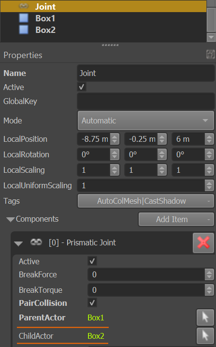
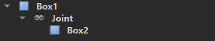

# Physics Joints

A *PhysX joint* is a component that links [PhysX actors](../actors/physx-actors.md) to constrain their movement. There are multiple types of joints that each constrain the actors in different ways.

Joints can be used for simple things like door hinges, up to complex configurations like rag dolls.

## Joining Actors

Joints can be used to link:

* Two [dynamic actors](../actors/physx-dynamic-actor-component.md). This will create a more complex dynamic object that can still freely move throughout the scene, but has multiple parts that can wiggle around.
* One [static actor](../actors/physx-static-actor-component.md) with one [dynamic actor](../actors/physx-dynamic-actor-component.md). In this case the dynamic actor is now constrained in its movement relative to the static actor. Since the static actor never moves, the dynamic actor's freedom is severly limited.
* One [dynamic actor](../actors/physx-dynamic-actor-component.md) with no second actor. This just affixes the dynamic actor with 'the world'. This is effectively the same as joining it with another static actor.

There are two ways that a joint component can link actors.

### Using Object References

The more flexibly way is to use the [object references](../../scenes/object-references.md) on the joint component to specify the *parent actor* and the *child actor*:

With this method, the [game objects](../../runtime/world/game-objects.md) for the actors and the joint don't need to have a specific hierarchy, they can be placed just next to each other. This also allows to create *loops* of linked actors. On the other hand, you always need to know exactly which actors shall be linked.

### Using the Object Hierarchy

Another method is to put the actors and the link into a proper parent/child hierarchy, where the joint is wedged between two actors:

In this case, the joint will link the closest parent actor that it can find, with the next best child actor.

This method can be useful especially when you want to put the joint into a [prefab](../../prefabs/prefabs-overview.md). For example, if you have a prefab for a chandelier that can swing around, you can set up the joint to only reference the actor that represents the chandelier, but the prefab does not contain an actor for the anchor point. If this prefab is placed into a scene, the rule that a joint *without* a parent actor just gets linked to the world, means that you can easily place these prefabs in a scene, and they will swing around the location where they have been instantiated.

However, if your scene contains for example a moveable room, you can also place it there and make sure to attach the chandelier prefab as a child node of the moveable room actor. That means, the joint of the chandelier will now link the chandelier actor with the moveable room actor, and thus whenever the room moves, the chandelier will be physically dragged by that.

> **Important:**
>
> This method of linking actors only works properly, if the parent actor is either **static** or **kinematic**. It doesn't work for simulated dynamic actors, as the transform update will introduce jitter.

## Joint Position

The position and rotation of a joint object specifies the pivot point. For [revolute joints (TODO)](physx-revolute-joint-component.md), [spherical joints](physx-spherical-joint-component.md) and [6DOF joints (TODO)](physx-6dof-joint-component.md) the position of the joint determines around which point the linked actors rotate. For [fixed joints](physx-fixed-joint-component.md) the position still affects how strong forces may become due to lever effects.

For [distance joints (TODO)](physx-distance-joint-component.md) the joint position determines from where the distance is computed. Only for [prismatic joints (TODO)](physx-prismatic-joint-component.md) is the position of the joint less relevant, though for computational stability, it should still be somewhere in between the linked actors.

## Shared Joint Component Properties

These properties are shared among all joint types:

* `BreakForce`, `BreakTorque`: By specifying non-zero values here, the joint is turned into a *breakable* joint. If enough force is applied to the joint, it will break apart and the two actors are not linked any further. Unfortunately it can be tricky to choose a proper break threshold, especially for torques, as some interactions produce surprisingly large forces, whereas other actions don't.
* `PairCollision`: By default actors that are linked with a joint will not collide with each other, instead they will pass through each other. Some joints have options that won't allow such situations to happen, and those options are always more efficient and preferable. However, you can also enable this, to have the two actors still collide with each other.
* `ParentActor`, `ChildActor`: References to objects with [actor components](../actors/physx-actors.md) to link with this joint. If not set, the parent/child hierarchy is used instead.

## Joint Types

These types of constraints are currently available:

* [PhysX Revolute Joint Component (TODO)](physx-revolute-joint-component.md)
* [PhysX Spherical Joint Component](physx-spherical-joint-component.md)
* [PhysX Fixed Joint Component](physx-fixed-joint-component.md)
* [PhysX Prismatic Joint Component (TODO)](physx-prismatic-joint-component.md)
* [PhysX Distance Joint Component (TODO)](physx-distance-joint-component.md)
* [PhysX 6DOF Joint Component (TODO)](physx-6dof-joint-component.md)

## Joint Stability

Joining multiple actors in a chain can quickly result in really bad simulation results. Have a look at [dynamic actor simulation stability](../actors/physx-dynamic-actor-component.md#simulation-stability) for ways to improve this. When working with joints the following aspects help a lot:

* Make sure that the involved actors are not too light. For smaller objects they automatically computed mass is often too low for the joint to be stable.
* Drastically increase linear and especially angular damping on the actors (`0.1` to `0.8`).
* Reduce `MaxContactImpulse`, especially on smaller actors.
* Don't create very long chains, try to achieve the desired result with as few joints as possible.
* Don't use joint limits (revolute joint, spherical joint), they can add significant instability.

Also have a look at NVIDIA's recommendations: [Configuring Joints for Best Behavior (nvidia.com)](https://gameworksdocs.nvidia.com/PhysX/4.0/documentation/PhysXGuide/Manual/Joints.html#configuring-joints-for-best-behavior)

## See Also

* [Back to Index](../../index.md)
* [PhysX Actors](../actors/physx-actors.md)
* [Joints (nvidia.com)](https://gameworksdocs.nvidia.com/PhysX/4.0/documentation/PhysXGuide/Manual/Joints.html)
