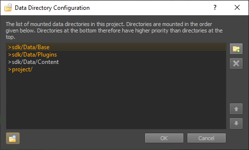

# Data Directories

*Data directories* are a vital concept in ezEngine. They define where on disk the game data resides, which data is accessible to your project and how. Data directories can be used to organize your assets and share content across multiple [projects](projects-overview.md).

For the typical use case, you can treat a data directory simply as a *folder*, which is *mounted* in your game, making all files in that folder accessible. Your game can mount an arbitrary number of data directories. Files outside of data directories are **not accessible** by the game engine. The editor displays all available [assets](../assets/assets-overview.md) from the mounted directories in the [asset browser](../assets/asset-browser.md). When browsing for a file, the editor actively refuses to use files that are not inside a mounted data directory. Otherwise this file would not be readable by the engine.

The engine only operates with relative paths, it never stores absolute file paths. Thus, the data directory can be moved to a different location. This is what makes it easily possible to copy the game to a different computer in a different location. As long as the startup code is able to locate the data directories, the rest of the engine will work without a change.

## Mounting Data Directories

### Using the Editor

Typically you should use the editor to configure which folders will be accessible as data directories. Go to *Editor > Project Settings > Data Directories...*:

Here you can add, remove and reorder them. Setting up the data directories of a project should be one of the very first steps after creating a new project.

You may notice the `>sdk` and `>project` prefixes. These are *special directory* indicators, meaning those paths are relative to the *SDK directory* (where the engine is installed) or the *project directory* (where your project is located). These indicators are automatically inserted when you browse for a folder. They enable the engine to find the same folder again, even if you move the project, or you need to stream the data using [FileServe (TODO)](../tools/fileserve.md).

### From Custom Code

You can also mount data directories from code. Usually you would do this either in a custom [application (TODO)](../runtime/application/application.md) class or in a [game state (TODO)](../runtime/application/game-state.md). Either way, you should do this early at game startup. For more more information, see the [filesystem documentation](../runtime/filesystem.md#data-directories).

## See Also

* [Back to Index](../index.md)
* [FileSystem](../runtime/filesystem.md)
* [FileServe (TODO)](../tools/fileserve.md)
* [Projects](projects-overview.md)
* [Application (TODO)](../runtime/application/application.md)
* [Game States (TODO)](../runtime/application/game-state.md)
