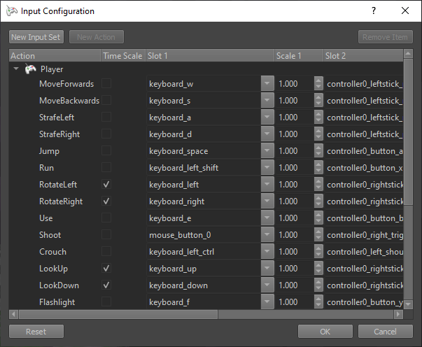

# Project Settings

Project settings are options that are configured once and affect the entire application. Most project settings can be configured from the editor, though some (currently) can only be configured by writing certain configuration files manually.

In the editor you will find the project settings under *Editor > Project Settings > ...*.

## Data Directories

*Editor > Project Settings > Data Directories...* opens a dialog to set up the [data directories](data-directories.md).

## Engine Plugins

*Editor > Project Settings > Engine Plugins...* opens a dialog to configure the active [engine plugins (TODO)](../custom-code/cpp/engine-plugins.md):

This dialog shows all available engine plugins. These are DLLs that are located in the same directory as `Editor.exe`. Note that ez uses a specific name schema to differentiate which DLLs are considered engine plugins:

* All DLLs named `ezEnginePluginXYZ.dll` are considered to be plugins for the engine, but typically only used in conjunction with another plugin called `ezEditorPluginXYZ.dll`. These are only needed by `EditorEngineProcess.exe` to implement editor specific functionality such as 3D previews of assets. These plugins are **not needed** by the final game application and are not loaded by [ezPlayer](../tools/player.md) when [running an exported scene](../editor/run-scene.md#export-and-run).

* All DLLs named `ezXYZPlugin.dll` are considered to be proper plugins for the engine and implement runtime functionality. When your game uses a feature from one of these plugins, you need to make sure that the corresponding DLL is checked in this list, such that stand-alone applications will load the DLL.

In the list above a number of plugins have a **checkmark**. Also, most plugins are tagged with **(active)**, even if they are not checked:

* **Checked** plugins are the ones that are selected to be loaded by stand-alone applications such as [ezPlayer](../tools/player.md) or your own [application (TODO)](../runtime/application/application.md). These are the plugins that you consciously decided to use in your final game. Consequently you need to ship those DLLs and you can use all the features that they provide.

* **Active** plugins are DLLs that are currently loaded by the engine process. Their functionality is therefore available to you in the editor. As you can see, there are many *active* plugins, although they are not *checked*. This is because plugins can have dependencies on other plugins. The editor automatically loads most [editor plugins (TODO)](../editor/editor-plugins.md), which provide most of the editing functionality, and those will automatically include the necessary engine plugins. Therefore, even though you may not want to use the [Recast integration (TODO)](../ai/recast.md) in your game, the `ezRecastPlugin` is still *active* in the editor, because the `ezEditorPluginRecast` is loaded. This allows you to use the Recast functionality (to generate navmeshes), but if you were to export your game and run it stand-alone, all Recast specific components would be ignored.

If you want to fully remove a certain integration, even in the editor, you need to edit the list of [editor plugins (TODO)](../editor/editor-plugins.md). Then plugin specific asset types will not show up in the [asset browser](../assets/asset-browser.md) and its dedicated [components (TODO)](../runtime/world/custom-components.md) won't show up in the component list. However, this is a machine wide setting, that applies to all projects and should only be done when a plugin interacts badly with some other functionality.

### Loading Plugins from Code

A custom [application (TODO)](../runtime/application/application.md) or [game state (TODO)](../runtime/application/game-state.md) can load plugins directly from code if necessary. For example the `ezInspectorPlugin` is automatically loaded for you by stock ez applications, when building the code for development.

## Input Configuration

*Editor > Project Settings > Input Configuration...* opens a dialog to configure the available input actions.

See the [input chapter (TODO)](../input/input-overview.md) for background information.

Using the *New Input Set* button at the top left, you can add *input sets*. These typically represent a certain state in your game. For example you may have one set for when the player character is by foot, and another input set for when they are steering a vehicle. Both input sets can use the same keys, but they may represent different actions. Since both states are mutually exclusive in the game, they don't clash. Each [input component (TODO)](../input/input-component.md) takes its input state from one specific input set.

Using the *New Action* button, you can add an action to the selected input set. Each *action* represents something that the player can *do*. You can then select a an *input slot* that triggers this action. Slots represent keyboard keys, controller buttons, voice commands, head movements and everything else that can be considered 'input'. The **Scale** value allows to adjust how strongly a slot activates the action.

The **Time Scale** option specifies whether the [0; 1] value of an action will be taken 1:1 from the input slot, or whether the value will be scaled by the amount of time passed between frames.

As an example, many actions like *shoot* or *jump* are purely on/off decisions. For these actions time scaling has no use. However, an action like 'rotate left/right' should be something that is smooth and always the same speed, no matter whether the game runs at 30 Hz or at 60 Hz or wildly varies. Thus the value that is given to the game code should be scaled by the time that has passed between frames, such that applying the value to your character or vehicle will still result in a constant, smooth change.

### Configuring Available Slots

The input slots that can be chosen in this dialog are listed in files located under `Data/Tools/ezEditor/InputSlots`. If you want to expose new slots for a custom input device, you can just add a file there. At the moment the available slots are not automatically extracted from the plugins.

## Tags

*Editor > Project Settings > Tags...* opens a dialog to configure which [tags](tags.md) are available in the project.

## Window Configuration

*Editor > Project Settings > Window Configuration...* opens a dialog to configure the default window configuration when [running a scene](../editor/run-scene.md).

These settings allow you to configure basic window settings for Play-the-Game mode and when running an exported scene in [ezPlayer](../tools/player.md). A proper game would typically implement this logic in a custom [application (TODO)](../runtime/application/application.md) and should allow the user to choose settings such as the resolution. The window configuration dialog is mainly for use during development.

There are two separately stored configurations:

**Project Default:** This configuration will be stored in the project folder and thus should be checked into source control to be shared with others.

**User Specific:** This configuration is only stored locally for the active user and not in the project directory. Therefore it cannot be checked into source control. It is meant for users who want to use settings different from the project default. For instance, when you have multiple monitors, you may want the exported scene to always appear on a specific one. This configuration must be enabled to override the default one.

Apart from the window position and size, the window configuration also controls the behavior of the mouse. If **Clip Mouse Cursor** is enabled, the mouse won't be able to leave the window area. This should be preferred for games that hide the mouse and only use relative mouse movement.

## Asset Profiles

*Editor > Project Settings > Asset Profiles...* opens a dialog to edit [asset profiles (TODO)](../assets/asset-profiles.md).

## FMOD

If the [FMOD Integration (TODO)](../sound/fmod-overview.md) is enabled, *Editor > Project Settings > Fmod Project Settings...* will be available to configure the speaker mode and which master sound bank to use.

## PhysX

If the [PhysX Integration (TODO)](../physics/physx-overview.md) is enabled, *Editor > Project Settings > PhysX Project Settings...* will be available to configure the [collision layers (TODO)](../physics/collision-layers.md).

## See Also

* [Back to Index](../index.md)
* [Projects](projects-overview.md)
