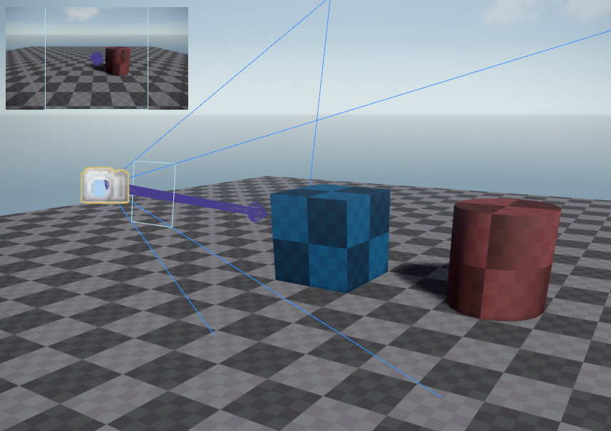

# Tags

A *tag* is a semantic label. On its own a tag has no functionality. Tags are grouped in *categories*. When an object supports tags, that means it allows you to add or remove all the tags from one specific category.

Tags are mainly used by *game objects* (`ezGameObject`). Game objects use the tag category *Default*. Apart from a handful of built-in tags, you are free to add your own tags.

Tags are mainly used for searching and filtering. A common use case is to query the game world for objects in an area, and only return those that have or don't have certain tags. For example you can add a tag 'usable' and then mark up all objects in your game that the player may interact with. This can then be used to highlight all usable objects in the player's vicinity.

In the image below the selected game object only has `My Custom Tag` assigned, all other tags are unassigned.

## Tags Configuration

*Editor > Project Settings > Tags...* opens a dialog to configure which tags are available in the project.

Using *New Category* you can set up multiple tag categories. However, which categories are used where, is defined by code. *Game objects* for example, use tags from the *Default* category. Unless you have [custom components](../runtime/world/components.md) which use a different tag category, there is no use in adding a new category.

**Important:** Be careful how you name your tags, they cannot be renamed. Once tags are used and saved in scene files, you would need to manually modify scene and prefab files to change their name.

## Object Visibility

Tags are used by the renderer to decide which objects to include or exclude from certain views. For this, *camera components* have two properties: `IncludeTags` and `ExcludeTags`. If any *include tag* is set on the camera, it will only show objects that have at least all those tags set. If any *exclude tag* is set, the camera will not render any object that has at least one of those tags set.

You can use this to make objects invisible in certain views and only render them in certain other views.

This mechanism is also used to decide which objects cast [shadows (TODO)](../graphics/lighting-overview.md). Only objects with the *CastShadow* tag will be included in the shadow map generation.

**Note:** The editor uses its own render view, for which you currently cannot edit the include and exclude tags. You have to launch [Play-the-Game mode](../editor/run-scene.md) for the engine to render the scene using your custom camera setup, to see the final result. You can, however, select a camera object and look at its preview window, to see the effect of the tag setup.

The image below shows two objects. The blue object on the left has the *Invisible* tag set, as well as the *CastShadow* tag removed. The selected camera object has the *Invisible* tag set as an *ExclusionTag*. Both the red and the blue object are visible in the editor, but the camera preview in the top left of the viewport only shows the red object.

## Limitations

Tags are always set directly on one object. They are not inherited to child objects and usually the code that evaluates tags does not check parent objects for their tags. Thus, to exclude an object from a view, the tag has to be set directly on the render object. Setting it on parent node or a [prefab instance](../prefabs/prefabs-overview.md), for example, won't work.

Similarly, if you want to make an object invisible in one view, you probably also need to disable shadow casting on it. If, however, it should be visible in another view, it cannot cast a shadow in that view, as the shadow maps are shared between the views.

## See Also

* [Back to Index](../index.md)
* [Project Settings](project-settings.md)
* [PhysX Integration (TODO)](../physics/physx-overview.md)
* [Lighting (TODO)](../graphics/lighting-overview.md)
