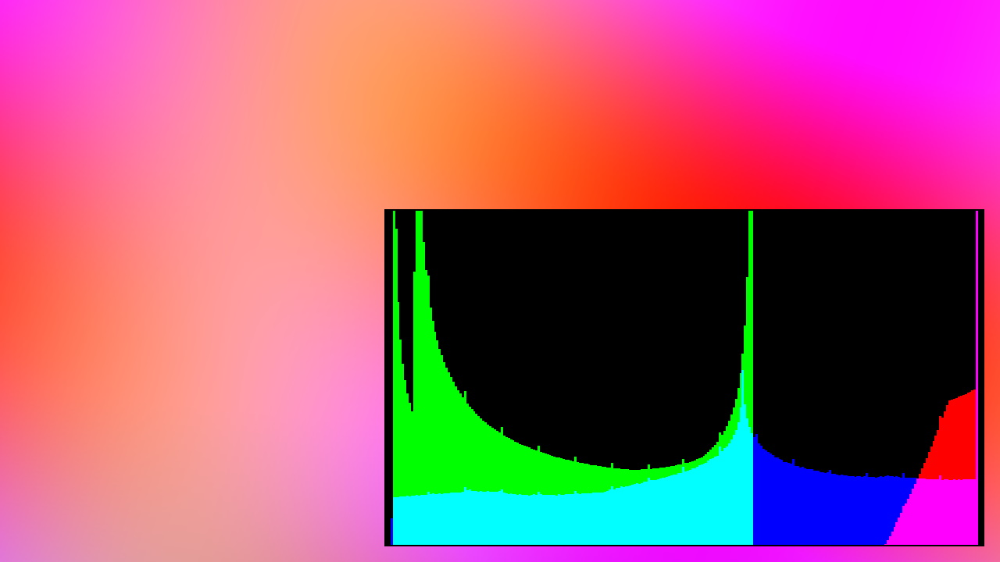

# Compute Shader Histogram Sample

The **ComputeShaderHistogram Sample** shows how to write a simple compute shader, which takes an input image and generates a color histogram.

## Prerequisites

**Note:** The sample is only available when the solution is built with **EZ_BUILD_SAMPLES** activated in CMake.

## Code

The code shows how to use the ez rendering API to set up buffers and textures, load shaders, etc. It also demonstrates how one can watch a directory for file changes and reload resources on the fly, to iterate on shaders.

## See Also

* [Back to Index](../index.md)
* [Videos](../appendix/videos.md)