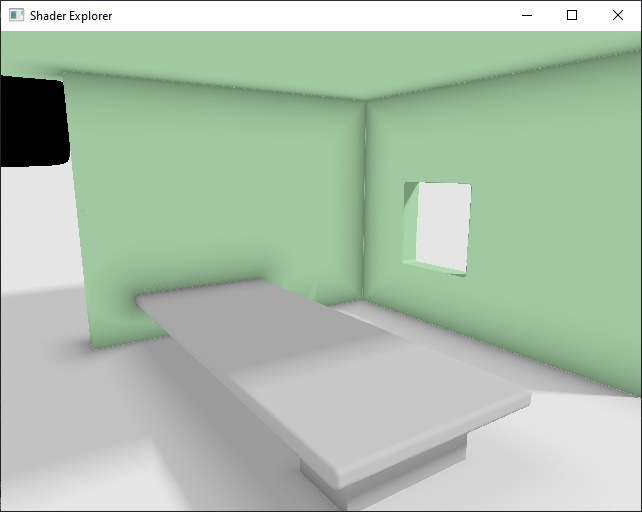
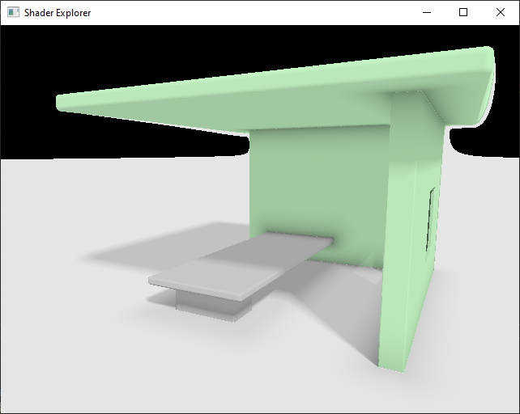

# Shader Explorer Sample

The **ShaderExplorer Sample** shows how to render a scene entirely in the shader, with no polygonal geometry. The shader evaluates geometric shapes and computes color and shadows inside the shader.

## Prerequisites

**Note:** The sample is only available when the solution is built with **EZ_BUILD_SAMPLES** activated in CMake.

## Code

The C++ code uses a minimal setup to load the shaders and render a quad on screen. Check out the shader code to see how the scene rendering is done.

## See Also

* [Back to Index](../index.md)
* [Videos](../appendix/videos.md)