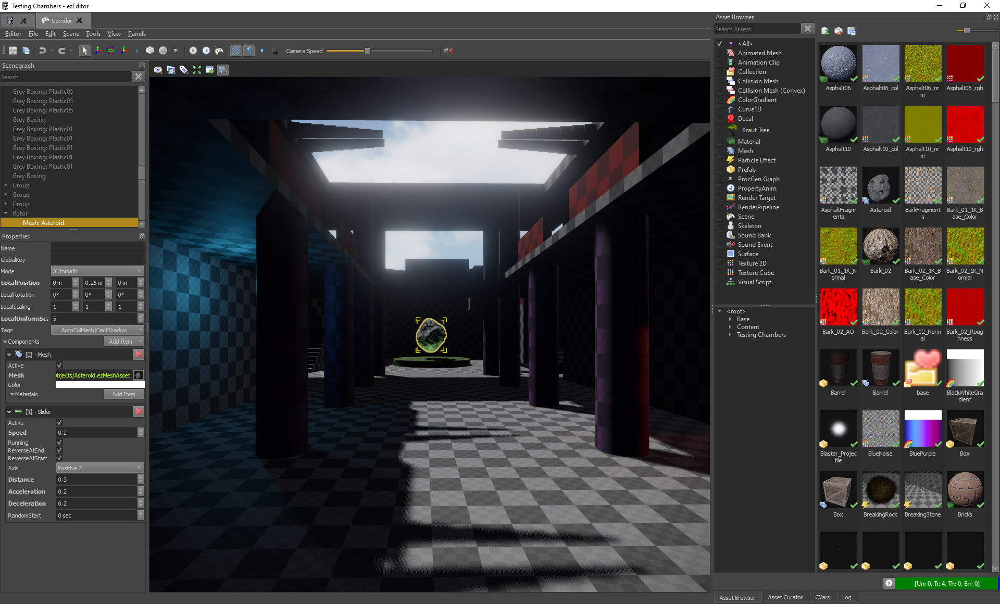
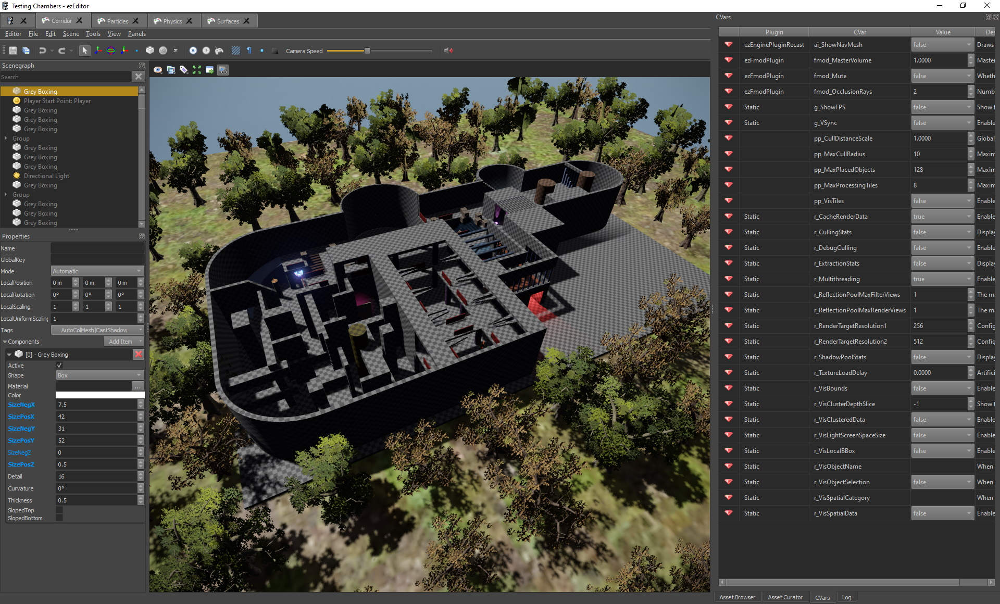
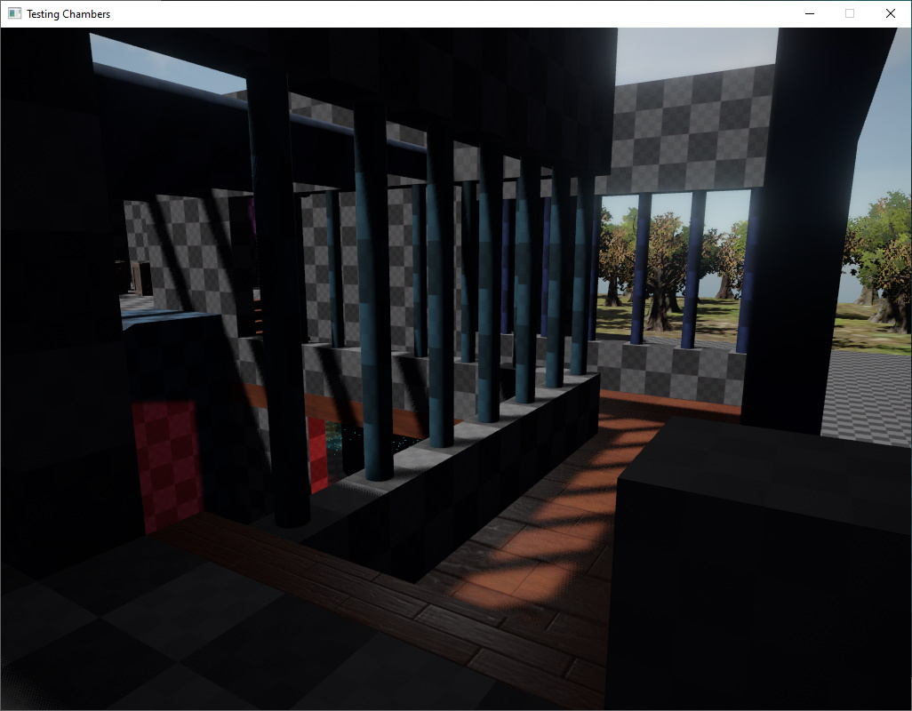

# Testing Chambers

The **Testing Chambers Project** is an editor-only project (no sample code required) that shows various features of the engine. It is a good starting point to play around with and get to know the editor.

## Prerequisites

This sample is data only and no extra code needs to be compiled to make it run.

## Project

The editor project belonging to this sample can be found under *Data/Samples/Testing Chambers*.

Open the *Corridor* scene document. Make sure to transform all assets (in the *AssetBrowser* panel the box with the red arrow). Then press 'Play the Game' in the scene. Use WSAD to move around, left click to shoot, *Space* to jump, *CTRL* to crouch and *1, 2 and 3* to switch weapons.

## See Also

* [Back to Index](../index.md)
* [Videos](../getting-started/videos.md)