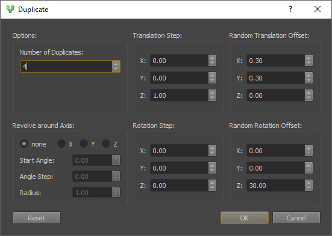
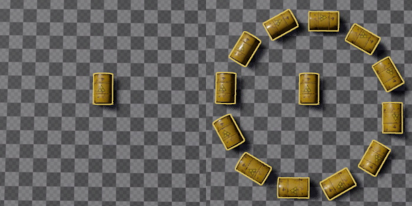
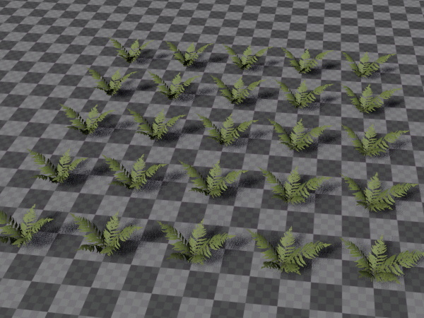
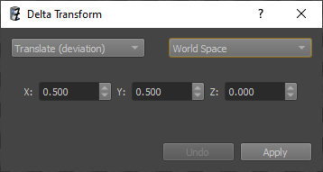
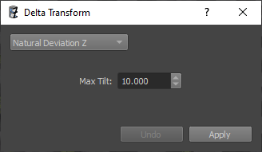
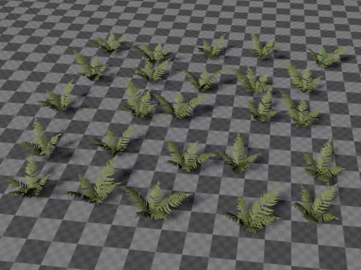

# Advanced Object Transforms

This page describes advanced methods to modify scene objects.

## Duplicate

The *Duplicate* dialog enables you to quickly create a vast number of copies of the selected objects, while adjusting their position and rotation. The duplicate dialog can be opened with `CTRL+D`.

Although the dialog has many options, in practice you typically only need to specify the number of desired duplicates and the *Translation Step*. The translation step is a fixed position offset that is added onto each new instance, placing the objects along a line. The *Random Translation Offset* can be used to randomly add some variation to each object's position. In the example above, an additional random rotation is applied to each object. The result of this operation is shown below:

You can also use *Revolve around Axis*. If this is enabled, the selected object is the center point and all duplicates will be created at distance *Radius*, revolving around the center, using an arc difference of *Angle Step* for each duplicate.

If you additionally set a *Rotation Step*, the objects will line up as in the the example below:

## Delta Transform

The *Delta Transform* dialog can be opened with `CTRL+M`. It can be used to move, rotate or scale objects precisely by typing in the desired amount of change. Its true power, however, lies in adding random variation to objects, to make them look more natural.

The image below shows plants in a perfectly regular grid:

Using the delta transform dialog, we can make this look much better.

The drop down in the top left selects the transform mode. `(random)` means that the change on each object will be truly random. `(deviation)` means each object will be randomly adjusted using the given value as wiggle room, however, the amount of change follows a *Normal distribution*, meaning that extreme changes will appear far less often than moderate changes. This should be preferred for things that are supposed to look natural.

The drop down in the top right specifies whether the transform changes are done in *World Space*, or in *Local Space*, and whether they should be evaluated for each object individually, or only for the last selected item (as the pivot).

The undo button in the bottom left allows you to quickly try and undo various options.

Here, we modify the position, by applying a deviation of up to 0.5 along the X and Y axis. For this operation it could be done both in world space, as well as in local space for each item.

As a result, the plants look less like they are on a grid. You could click *Apply* multiple times, if you want to randomize the result even further.

Next, we randomly rotate all objects around the Z axis. Here we don't use a deviation, but a random change, and a rotation of [-180; +180] degree, as each object should indeed be truly randomly rotated. Note that this change is applied in `Local Space - Each Item`.

As a result, the plants now don't have a uniform rotation anymore:

Finally, we apply a 'natural' tilt to all objects. This is a *deviation* away from the Z axis and simulates that not all objects (especially plants) are perfectly straight.

Now our small patch of plants looks much less artificial:

You could go even further and apply a random scale to each object, as well.

## See Also

* [Back to Index](../index.md)
* [Editing Gizmos](gizmos.md)
* [Scene Editing](scene-editing.md)
