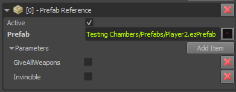
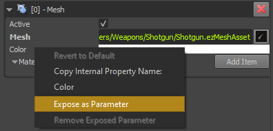
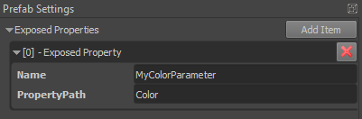

# Exposed Parameters

Some [asset types](../assets/assets-overview.md) support so called *exposed parameters*. That means that an asset, such as a [particle effect](../effects/particle-effects/particle-effects-overview.md), a [prefab](../prefabs/prefabs-overview.md) or a [script](../custom-code/typescript/typescript-overview.md) may provide parameters, that can be set through a corresponding component, such that each instance of the asset acts differently.

As an example, particle effects may expose a parameter that allows you to adjust their color. Now every time you add that particle effect to a scene, you can select the color for that particular instance, through the particle effect component. Similarly, scripts can expose parameters, which allow you to configure the starting conditions of the script.

Using exposed parameters to make an asset more versatile is usually less work and more efficient, than to build multiple variants of an asset.

## Exposed Prefab Parameters

In [prefabs](../prefabs/prefabs-overview.md) you can expose most types of properties of any component. When a prefab has any exposed parameters, they show up in the prefab reference component like this:

The `X` button to the right of each parameter lets you reset their value to the default.

To expose a property inside a prefab as a parameter, just right-click on the label of a property and choose *Expose as Parameter*:

You will be asked under what *name* the property shall be exposed. This allows you to select a more meaningful name for the purpose of the parameter. You are also allowed to use the same name for multiple exposed parameters, which means that the user only sees one parameter, but it may be bound to multiple internal properties.

Every prefab document has a *Prefab Settings* panel. This lists all the currently exposed parameters:

Here you can remove or rename an exposed parameter.

### Exposing Exposed Parameters

It is perfectly valid to expose a property as a prefab parameter, which itself is already an exposed parameter from a nested prefab, a particle effect or a script.

### Exposing Object References

If a prefab contains an object that requires an [object reference](object-references.md) to operate on, you can expose the object reference, and thus allow users of your prefab to let each prefab instance operate on different objects.

## See Also

* [Back to Index](../index.md)
* [Object References](object-references.md)
* [Particle Effect Component](../effects/particle-effects/particle-effect-component.md)
* [TypeScript Component](../custom-code/typescript/ts-component.md)
* [Prefabs](../prefabs/prefabs-overview.md)
