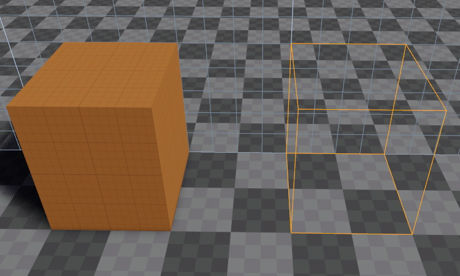

# Greyboxing

*Greyboxing* (or *whiteboxing*) is the process of blocking out a rough level concept to test ideas, before working on the details. The ez editor provides a dedicated tool to quickly create the most commonly needed geometric shapes to block out a level, such as boxes, stairs, ramps and columns.

## Creating Shapes

To activate the greyboxing tool, press the `B` key or click the brick icon in the toolbar. The statusbar will now display how to proceed.

1. Hold `CTRL`. If the [grid](gizmos.md#grid) is enabled, it will show in which plane you will draw. Now *left-click* and draw a rectangle.

    

1. *Release the left mouse button* to finish the rectangle. Now *move the mouse up and down* to choose the height of the box.

    

1. *Left-click* once more to finish the shape.

    

1. From the object properties you can now select a different shape.

    

1. Activate the [manipulator](gizmos.md#manipulators) to easily adjust the shape.

    

### Creating Shapes in Air

By default you will draw the next shape starting at the picked position under your mouse cursor. If you want to draw a series of platforms in air, you can reuse the *height* of the previously drawn shape by holding `CTRL` and `SHIFT` before drawing the next rectangle.

## Materials

You can change the material of a greybox shape either through its properties, or by dragging and dropping a material from the [asset browser](../assets/asset-browser.md) onto the shape. Additionally, if you have a material selected in the [asset browser](../assets/asset-browser.md) while creating a new shape, it will automatically get that material assigned.

## Static Collision

As long as a greyboxing object has the `AutoColMesh` [tag](../projects/tags.md), it will automatically get a [collision mesh](../physics/collision-shapes/collision-meshes.md) with the default [collision layer](../physics/collision-shapes/collision-layers.md) (`0`). It's assigned [material](../materials/materials-overview.md) determines which [surface](../materials/surfaces.md) is used for physical interactions.

## Dynamic Collision

The greyboxing shape is not meant to be used for dynamic collisions. That means, if you attach a dynamic [PhysX](../physics/physx-overview.md) actor, it will not get the necessary physical setup to behave correctly. Instead, its collision mesh will simply be disabled entirely. You can therefore use greybox shapes for dynamic objects, but you need to add the required physics shapes yourself.

## See Also

* [Back to Index](../index.md)
* [Scene Editing](scene-editing.md)
* [Editing Gizmos](gizmos.md)
* [Advanced Object Transforms](advanced-object-transform.md)
