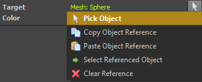

# Object References

Some components are supposed to work with other objects, but those objects are not in their hierarchy as a parent or child node, but may instead be any arbitrary object that the user wants to select. Such use cases are supported through *object references*, meaning that a component can have properties that store a reference to another object (within the same scene or prefab document).

A very basic example is the [DrawLineToObject component](../debugging/components/draw-line-component.md), which literally just draws a line between itself and a referenced object.

## Object Reference UI

In the editor UI an object reference property looks like this:


Left-clicking the arrow button will switch to object selection mode and turn the mouse cursor into a crosshair. Click on any object in the 3D viewport to select it as the referenced object.

> **Important:**
>
> You can also right-click the arrow button to bring up a menu with additional options.



Be aware that you can right click any node in the tree view or in the viewport and select `Copy Object Reference`, then use `Paste Object Reference` in the menu above to set the reference. This is sometimes easier than clicking on an object in the viewport.

## Object References in Custom Components

When you create a [custom component](../custom-code/cpp/custom-cpp-component.md) you may want to have an object reference property. The easiest way to achieve this, is to get inspiration from existing code, such as `ezLineToComponent`.

Object references are a 'non-trivial' (complicated) feature. They need to be remapped within instances of [prefabs](../prefabs/prefabs-overview.md), they work differently in the editor and the runtime, and it is possible to use them as [exposed parameters (TODO)](exposed-parameters.md). Consequently, you have to stick to a certain pattern to make them work.

Expose them as a string property and use custom functions as accessors. Also decorate them with `ezGameObjectReferenceAttribute`:

<!-- BEGIN-DOCS-CODE-SNIPPET: object-reference-property -->
```cpp
EZ_ACCESSOR_PROPERTY("Target", GetLineToTargetGuid, SetLineToTargetGuid)->AddAttributes(new ezGameObjectReferenceAttribute()),
```
<!-- END-DOCS-CODE-SNIPPET -->

The 'getter' accessor function is actually never called, but since `EZ_ACCESSOR_PROPERTY` expects a valid function, you need to have at least one dummy function that you can pass in. In your 'setter' function you need to query a 'reference resolver' from the world and use that to map the string to an actual game object handle. Here you also need to pass in information about the component and the property. This is mainly needed by the editor to handle undo/redo correctly.

<!-- BEGIN-DOCS-CODE-SNIPPET: object-reference-funcs -->
```cpp
void ezLineToComponent::SetLineToTargetGuid(const char* szTargetGuid)
{
  auto resolver = GetWorld()->GetGameObjectReferenceResolver();

  if (resolver.IsValid())
  {
    // tell the resolver our component handle and the name of the property for the object reference
    m_hTargetObject = resolver(szTargetGuid, GetHandle(), "Target");
  }
}

const char* ezLineToComponent::GetLineToTargetGuid() const
{
  // this function is never called
  return nullptr;
}
```
<!-- END-DOCS-CODE-SNIPPET -->

Finally, during component serialization you just use `ezWorldWriter::WriteGameObjectHandle()` and `ezWorldReader::ReadGameObjectHandle()` to save and restore the actual game object handle.

## See Also

* [Back to Index](../index.md)
