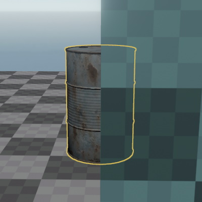
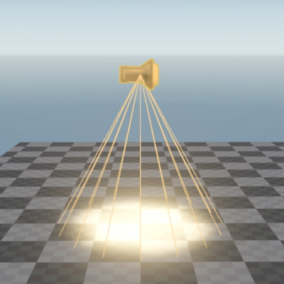

# Selecting Objects

This page describes everything related to object selection.

## Common

* Pressing `ESC` will clear the selection.

## Viewport - Single Selection

* *Left-click* on an object to select it.
* Hold `CTRL` to add or remove objects from the selection.
* Hold `CTRL` and *middle-click* an object to open its material document. This does not work for [prefab instances](../prefabs/prefabs-overview.md).

## Viewport - Marquee Selection

* Hold `SPACE` to enable marquee selection
* Then *left-click* and drag to *add* items to the selection
* Additionally hold `CTRL` before the left-click to instead *remove* items from the selection
* Press `ESC` to cancel the marquee selection

## Scene Tree

You can filter the scene tree with the search box at the top:

## Selection Pivot

If you select multiple objects, then the object that you add to your selection *last* determines the position of [editing gizmos](gizmos.md) and thus the pivot point for some operations. For example, you can rotate a group of objects around a specific point, by having a (dummy) object at that point and adding it to your selection last.

To change which object is your pivot, just hold `CTRL` and click an object to remove it from you selection, then click it *again* to re-add it to the selection. This way it will become the last object in the selection and therefore the new pivot.

## Selection Outline

Selected objects are highlighted with a yellow outline, which is visible through walls. This outline can be toggled with the `S` key or the respective toolbar button.

## Shape Icons

Some component types use a *shape icon* as their graphical representation. This makes it possible to select these types of objects in the viewport. Shape icons can be toggle with the `I` key.

## Selection Bounding Box

When [visualizers](gizmos.md#visualizers) are enabled, the editor display a yellow bounding box around each selected object. Visualizers can be toggled with the `V` key.

## Select Transparent

Press the `U` key to toggle whether transparent objects should be selectable. Disabling this can be very useful if you have large objects with special shaders, for instance to create atmospheric effects like volumetric lighting. Such shapes can prevent you from selecting anything else, even though they are mostly invisible.

## See Also

* [Back to Index](../index.md)
* [Editing Gizmos](gizmos.md)
* [Greyboxing](greyboxing.md)
* [Scene Editing](scene-editing.md)

