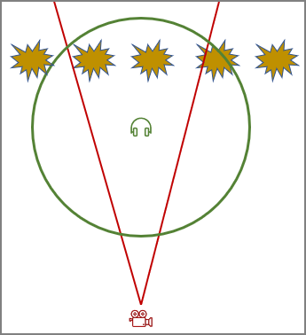

# Fmod Listener Component

The *Fmod listener component* represents the position and direction from where the player perceives sound. Every game must have exactly one listener component in the scene, to instruct Fmod how to compute the spatial sound.

For first-person and third-person games the listener component would be attached to the character controller, typically the same node where the main [camera component](../graphics/camera-component.md) is located.

For other kinds of games positioning the listener component can be more tricky. For example in a top down strategy game, or a 2D side scroller, you may move the camera very far out (to achieve the desired perspective). Though, if you were to place the listener component at the same position, you would either not hear anything (too far away), or if you adjust sound distances such that you hear something, you may hear sounds that are very far off screen.

In such situations it is better to move the listener component much closer to the action. The image below shows such a setup, where the listener is much closer to the action than the camera:

The red cone represents what the camera sees. The green circle visualizes the area in which sounds are audible.

## Multiple Listeners

If you build a multi-player game, you should be careful to only instantiate a single listener component for the local player, and don't accidentally duplicate the listeners from remote players.

However, Fmod also supports multiple listeners locally, in case you want to do split screen multi-player on the same machine. This is automatically enabled if multiple listeners are in the scene, with non-zero `ListenerIndex`. In multi-listener mode Fmod will deactivate many spatial audio effects and try to render the audio in the most sensible way. For details refer to the Fmod documentation.

## Component Properties

* `ListenerIndex`: Which listener this component represents. Should always be zero, unless you do a split-screen multi-player game.

## See Also

* [Back to Index](../index.md)
* [Fmod Integration](fmod-overview.md)
