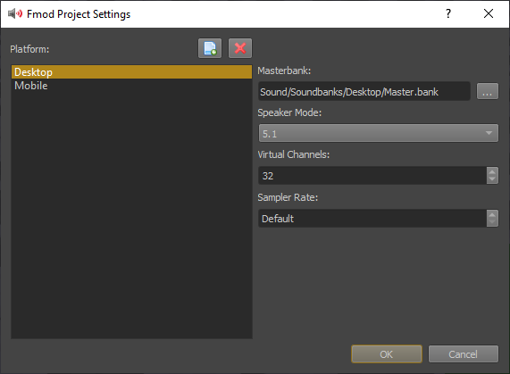
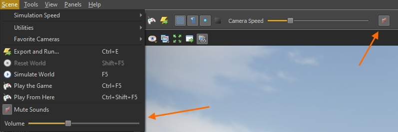

# Fmod Integration

[Fmod](https://www.fmod.com) is a world class sound engine used by many AAA games. *Fmod Studio* is an incredibly powerful tool to manage your sounds.

ezEngine integrates Fmod with a plugin. To enable Fmod support, follow these steps:

1. Create a free account at [Fmod.com](https://www.fmod.com) and sign in
1. Download and install the *Fmod Studio API SDK for Windows* (needed to compile the Fmod plugin)
1. Download and install *Fmod Studio* (only needed by people who want to edit Fmod projects)
1. Enable Fmod in the [CMake configuration](../build/cmake-config.md)
1. Compile the engine

## Using Fmod Studio

Fmod Studio has a vast number of features. Describing how it works is out of scope for this documentation. Instead have a look at these resources:

* [Fmod Learning Resources](https://www.fmod.com/learn)
* [Fmod Studio Documentation](https://www.fmod.com/resources/documentation-studio)

There is a set of tutorials about Fmod in Unreal, which is a very good introduction. There are also several videos about Fmod in Unity. Since most of the work is done in Fmod Studio anyway, most things that you see in those videos apply equally to ez.

* [FMOD Studio for UE4 Video 1 - Getting Started](https://www.youtube.com/watch?v=K64sGI9cKEg)
* [Audio for Unity 5: Viking Village (1/5) - Getting Started](https://www.youtube.com/watch?v=KkQ89ZXv5sQ)

## Fmod Project Settings

For project wide Fmod settings, go to *Editor > Project Settings > Fmod Project Settings...*

> **Important:**
>
> Although you can configure profiles for multiple platforms, at the moment only the **Desktop** profile will be used.

The most important thing to configure here is to choose the **Masterbank** file. For what a master sound bank is, please refer to the Fmod documentation. If you haven't created any sound banks yet, you should start by creating an Fmod Studio project and come back when you have exported a master bank.

The other options are best left at their default values. See the Fmod documentation for details.

Once you have these things set up, you can create your first [sound bank asset](fmod-soundbank-asset.md), through which you get Fmod sound data into the engine.

## Sample Data

A sample Fmod Studio project is available under *Data/Content/Sound*, including pre-exported sound banks. These are also used by the sample projects, such as the [Testing Chambers](../samples/testing-chambers.md).

## Scene Editing Settings

The Fmod editor plugin adds UI elements to *mute* sound entirely and to adjust the *master volume*:

## See Also

* [Back to Index](../index.md)
* [Sound](sound-overview.md)
* [www.fmod.com](https://www.fmod.com)
