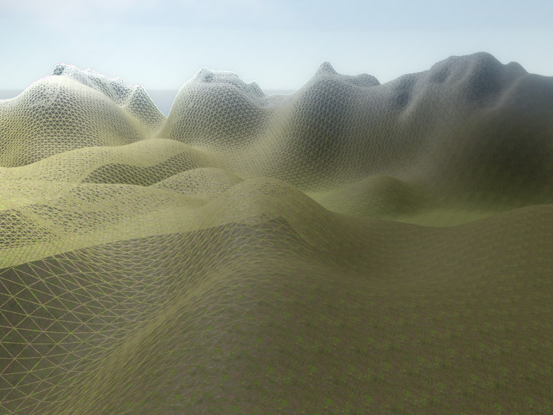
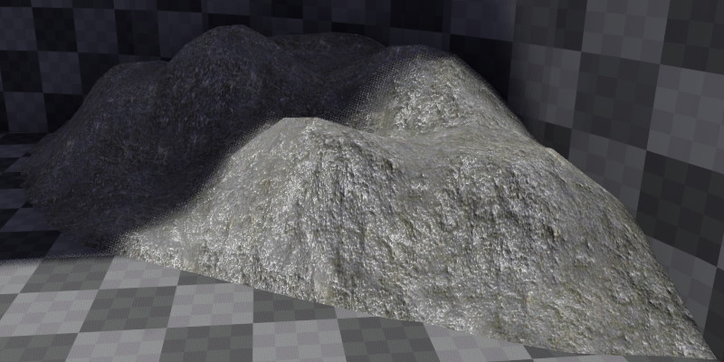

# Heightfield Component

The *HeightfieldComponent* can be used for simple, heightmap based terrain, as well as for adding small details like piles of rubble to a scene.

The heightfield component uses an [ImageData asset](../Miscellaneous/imagedata-asset.md) to get the height information. Consequently, the heightmap image has to be imported as such an asset type.

## Collision Mesh

When the [tag](../projects/tags.md) `AutoColMesh` is set on the owner game object, the component adds its mesh to the scene [collision mesh](../physics/collision-shapes/collision-meshes.md), just like the [greyboxing components](../scenes/greyboxing.md). This is only supported for [static game objects](../runtime/world/game-objects.md#static-vs-dynamic-objects) though.

Currently all triangles in the collision mesh will all use the same [surface](../materials/surfaces.md), the one set on the main material.

## Properties

`HeightfieldImage:` The [ImageData asset](../Miscellaneous/imagedata-asset.md) that contains the terrain height information.

`Material:` The single [material](../materials/materials-overview.md) used for the entire mesh. If you need multiple layers (grass, dirt, rock, etc) you can write a custom [visual shader (TODO)](../materials/visual-shaders.md) that uses a mask texture to fetch and blend the various layers as desired. The vegetation scene in the [Testing Chambers](../samples/testing-chambers.md) project does this.

`HalfExtents:` The size of the terrain in X and Y direction.

`Height:` How much to stretch the terrain along the up axis.

`Tesselation:` How densely to tesselate the *graphics* mesh.

`TexCoordOffset, TexCoordScale:` An offset and scale to shift and stretch the texture coordinates. Use a scale of one, if the material should be stretched once across the entire terrain. Use a large scale value instead, if the material should be repeated many times.

`ColMeshTesselation:` How densely to tesselate the *physics* mesh. It often makes sense to only use the half resolution of the graphics mesh.

## Performance Considerations

1. Consider to **deactivate casting shadows** by removing the `CastShadow` [tag](../projects/tags.md) on the owner game object. It is rare that terrain has such prominent features, that they would be cast visible shadows. However, densely tesselated terrain meshes add a high cost to the shadow map update.

1. Deactivate the collision mesh generation, if the terrain (or pile of rubble) is purely visual.

## See Also

* [Back to Index](../index.md)
* [Terrain and Vegetation](terrain-overview.md)
